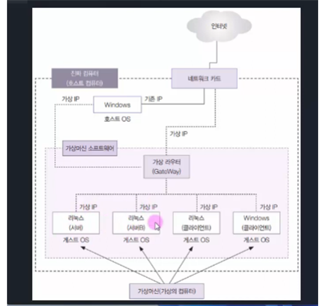
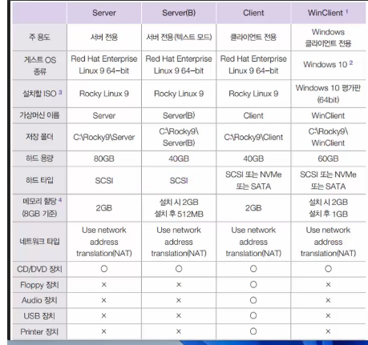
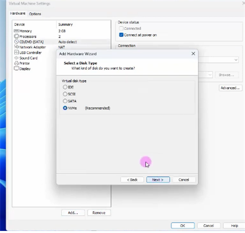
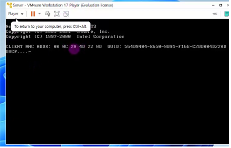
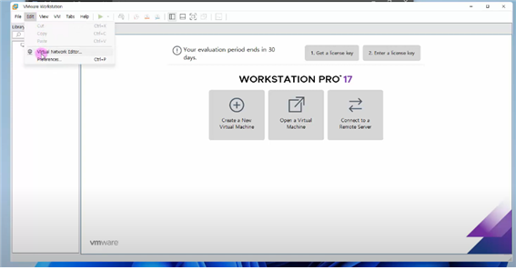
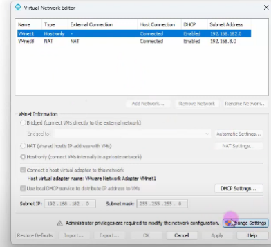
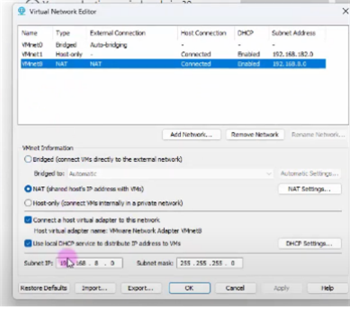
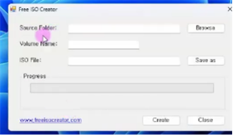
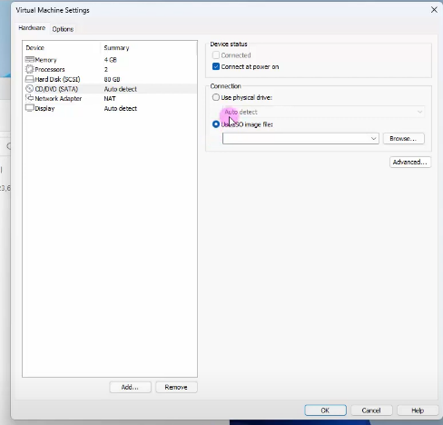

## **가상머신이란?**
가상머신은 하나의 물리적 컴퓨터에서 여러 개의 가상 컴퓨터를 구동할 수 있게 하는 소프트웨어나 하드웨어 환경을 말합니다. 이를 통해 하나의 시스템에서 여러 개의 운영 체제를 동시에 실행할 수 있습니다. 가상머신을 사용하면 리소스를 효율적으로 활용하고 다양한 운영 체제 환경에서 테스트 및 운영이 가능해집니다.

## **호스트 OS와 게스트 OS의 개념**
- **호스트 OS (Host OS):** 가상머신을 실행시키는 실제 머신(물리적인 컴퓨터)에 설치된 운영 체제를 의미합니다.
- **게스트 OS (Guest OS):** 가상머신 내에서 실행되는 가상의 운영 체제를 말합니다. 호스트 OS와 별개로 가상머신 안에서 동작하게 됩니다. 멀티 부팅과는 다르게 호스트와 게스트 간에 독립된 운영 체제가 동시에 실행됩니다.

## **가상머신과 가상머신 소프트웨어**
가상머신은 하드웨어 가상화를 지원하는 가상머신 소프트웨어를 통해 생성됩니다. 대표적인 가상머신 소프트웨어로는 VMware, VirtualBox, Hyper-V 등이 있습니다.

## **VMware란 무엇인가**
VMware는 가상화 솔루션을 제공하는 기업으로, 다양한 제품들을 통해 가상머신을 생성하고 관리할 수 있도록 도와줍니다. VMware Workstation은 개인이나 기업에서 가상머신을 운영하고 테스트하는 데에 널리 사용되며, 여러 기능을 포함하고 있습니다.

- **1대의 컴퓨터 만으로 운용 가능**
- **스냅숏 기능 사용 가능:** 시스템 상태를 저장하여 나중에 해당 상태로 가상머신을 되돌릴 수 있게 하는 기능
- **하드웨어를 여러개 장착해서 테스트 가능**
- **Suspend 기능:** 가상머신을 일시 중지하고 나중에 다시 시작할 수 있는 기능

## **설정하기**
가상머신을 설정하는 과정은 VMware Workstation에서 새로운 가상머신을 만들고 필요한 하드웨어 및 소프트웨어 설정을 구성하는 단계를 포함합니다.

## **가상머신 활성화**
가상머신을 실행하여 가상 운영 체제를 시작합니다.

## **게스트 OS 전체 화면 활성화**
가상머신에서 게스트 OS를 전체 화면으로 보기 위해 Ctrl + Alt + Enter 키를 사용할 수 있습니다.

## **여러대의 가상머신 동시에 부팅하기**
VMware Workstation Player를 사용하여 여러 개의 가상머신을 동시에 실행할 수 있습니다. 각각의 파일을 실행하여 여러 가상머신을 동시에 사용할 수 있습니다.

## **네트워크 정보 파악하기**
가상머신 내에서 네트워크 정보를 파악하기 위해 게스트 OS에서 `ipconfig /all` 명령어를 사용할 수 있습니다.

## **가상 머신 네트워크 설정**
VMware에서는 가상 머신의 네트워크 설정을 통해 가상 머신 간 또는 호스트와의 네트워크 통신을 구성할 수 있습니다.

## **호스트 OS와 게스트 OS 사이의 파일 전송**
파일을 호스트 OS와 게스트 OS 간에 전송하기 위해서는 ISO 파일을 생성하고 이를 이용하여 파일을 이동시킬 수 있습니다. ISO 파일은 물리적인 교환 매체 없이 파일을 가상 머신 간에 전송할 때 편리하게 사용됩니다.

