### 1. Rocky 9.0 다운로드 

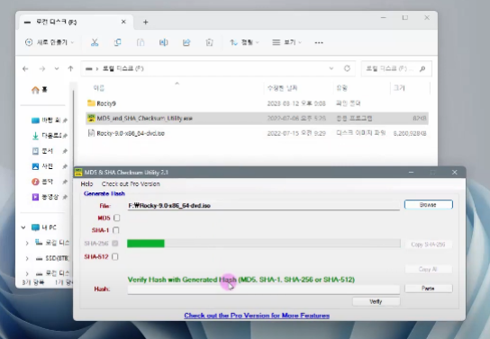

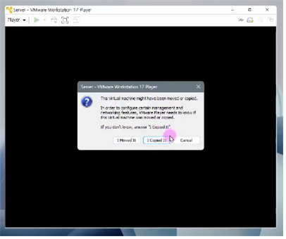

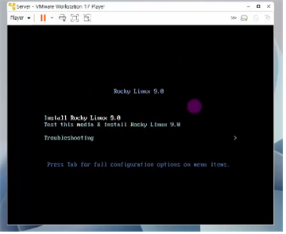

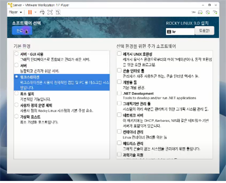

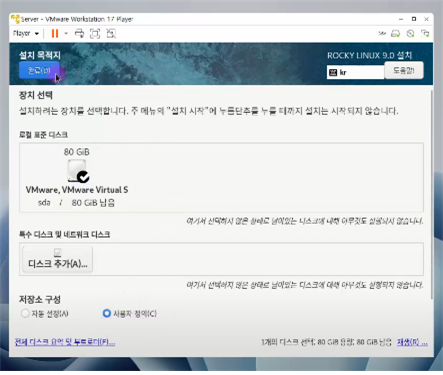

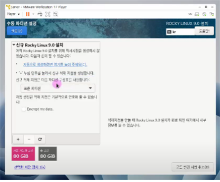

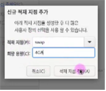

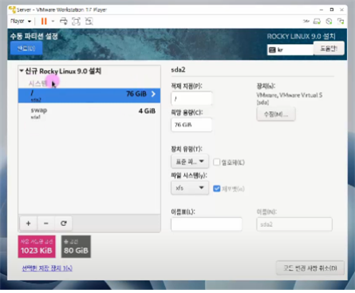

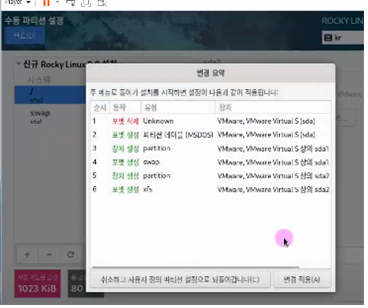

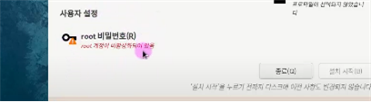

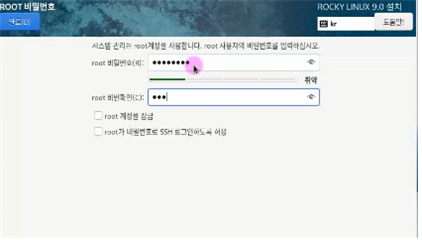

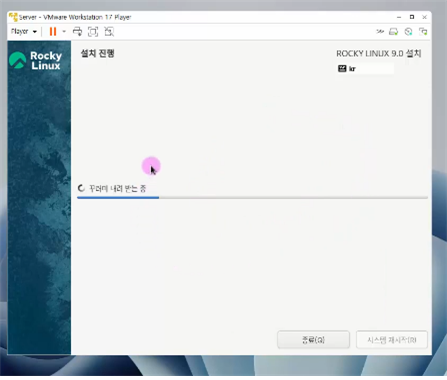

### 시스템 재시작 => 부팅

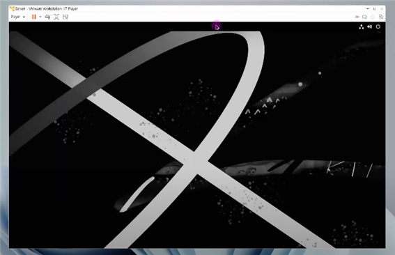

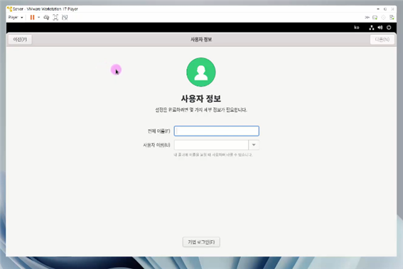

### 2. 관련 설정하기 => root 사용자로 접속 (서버)

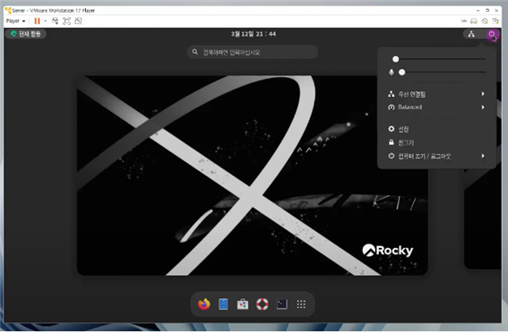

### 설정: 해상도 => 1024 X 768

### 개인정보: 화면잠금 => 안함, 알림 끄기

### 업데이트 기능 끄기:

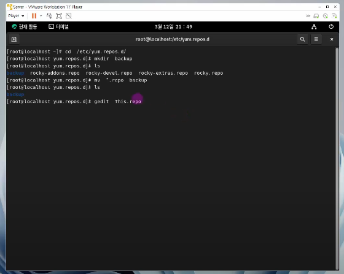

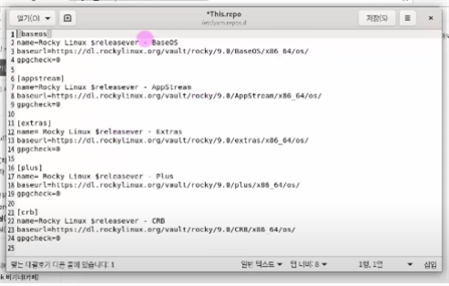

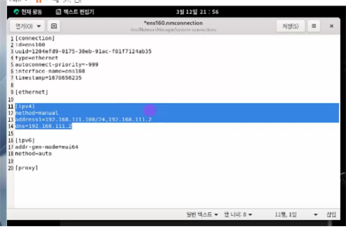

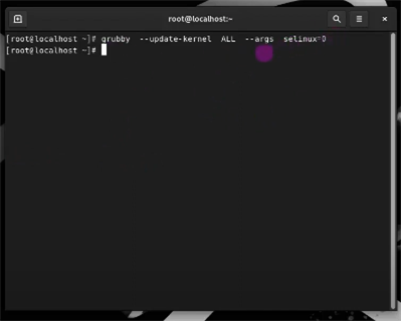

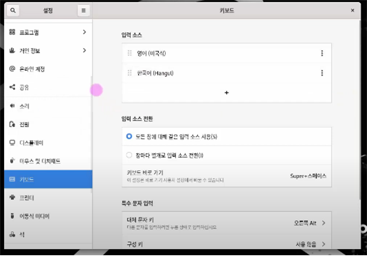

쉬프트 + 스페이스 => 한영 키보드 전환

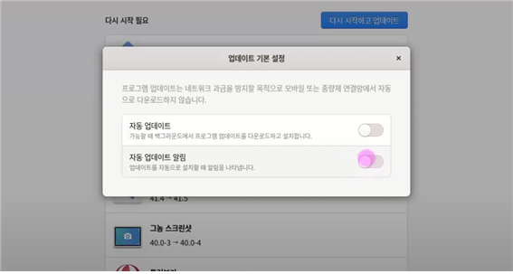

해상도 고정 =>

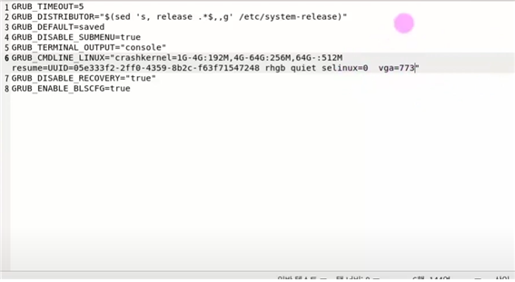

스냅샷 설정하기

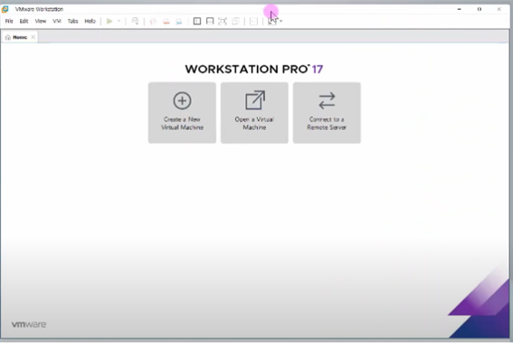

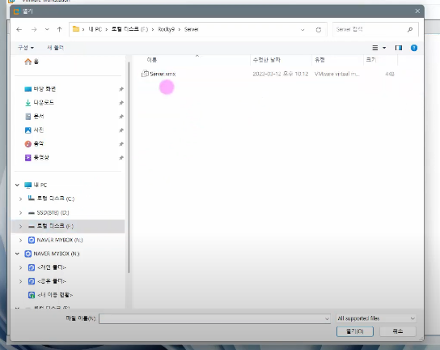

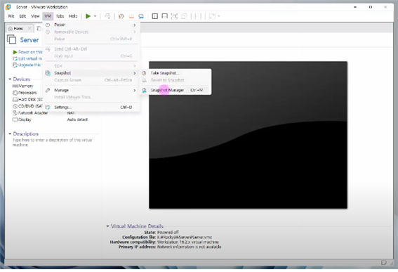

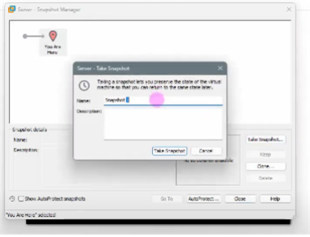

### 3. 가상머신 초기화 방법

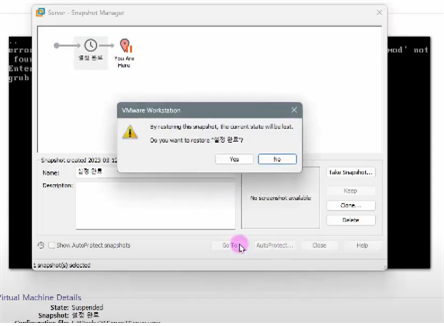

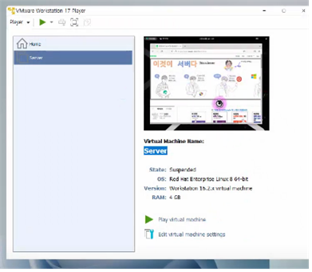

### suspend 상태에서는 시스템 설정 변경이 불가능하다. 정상적으로 종료해야 설정 변경이 가능

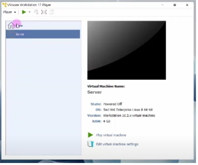

