### 1. 시스템 시작과 종료

1. **시스템 종료 (Shutdown):**
    - `shutdown -h now` : 시스템을 즉시 종료합니다.
    - `shutdown -h +5` : 5분 후에 시스템을 종료합니다.
    - `poweroff` : 시스템을 종료하고 전원을 끕니다.

2. **재부팅 (Reboot):**
    - `reboot` : 시스템을 재부팅합니다.
    - `shutdown -r now` : 시스템을 즉시 재부팅합니다.

3. **시스템 종료 (Halt):**
    - `halt` : 시스템을 정지시킵니다.
    - `halt -p` 또는 `poweroff` : 시스템을 종료하고 전원을 끕니다.
    - `init 0` : 시스템을 종료합니다.

터미널에서 위의 명령어를 실행하려면 관리자 권한이 필요할 수 있습니다. 따라서 `sudo`나 `su` 등을 사용하여 명령을 실행하는 것이 일반적입니다.

### 2. 시스템 재 부팅

1. `shutdown -r now`: 시스템을 즉시 재부팅합니다. 이 명령어는 `shutdown` 명령어의 옵션 `-r`은 "재부팅"을 나타내며, `now`는 명령을 즉시 실행하라는 의미입니다.

2. `reboot`: 시스템을 재부팅합니다. 단순히 `reboot` 명령어를 입력하면 시스템이 재부팅됩니다.

3. `init 6`: 시스템을 재부팅합니다. `init`은 시스템 초기화 프로세스를 관리하는 명령어이며, 여기서 `6`은 재부팅을 나타냅니다. 일반적으로 `init` 명령어는 레벨 또는 타겟을 변경하는 데 사용되는데, 레벨 6은 재부팅을 나타냅니다.

### 3. 로그아웃

1. `logout`: 현재 사용자를 로그아웃합니다. 이 명령은 현재 쉘 세션을 종료하고 로그인 화면 또는 다른 사용자로 전환합니다.

2. `exit`: 현재 쉘을 종료합니다. 만약 여러 개의 쉘이 중첩되어 있다면, 가장 외부의 쉘에서 사용되어야 합니다. 쉘을 종료하면 로그아웃이 이루어집니다.

주의: `logout`과 `exit` 명령은 로그아웃 또는 쉘 종료를 수행하므로 현재 작업 중인 모든 프로세스 및 작업이 종료될 수 있습니다. 저장하지 않은 작업이 있다면 주의해야 합니다.

cf) 프롬프트 기호에 대한 설명:
- `#`: 루트 (root) 사용자를 나타냅니다. 일반적으로 관리자 권한을 가진 사용자입니다.
- `$`: 일반 사용자를 나타냅니다. 일반적인 명령을 실행할 때 사용됩니다.

### 4. 가상콘솔

가상 콘솔은 다음과 같습니다:

- **Ctrl + Alt + F1**: 첫 번째 가상 콘솔
- **Ctrl + Alt + F2**: 두 번째 가상 콘솔
- ...
- **Ctrl + Alt + F6**: 여섯 번째 가상 콘솔

각 가상 콘솔은 독립된 터미널 세션으로 동작하며, 여러 작업을 동시에 수행할 수 있습니다. 예를 들어, Ctrl + Alt + F1로 이동하여 터미널에서 작업을 하고, Ctrl + Alt + F2로 이동하여 다른 터미널에서 별도의 작업을 할 수 있습니다. 이후에는 Ctrl + Alt + F7을 사용하여 기본 그래픽 환경으로 돌아갈 수 있습니다. (가상 콘솔 F7은 주로 그래픽 환경을 나타냅니다.)

### 5. 초기화
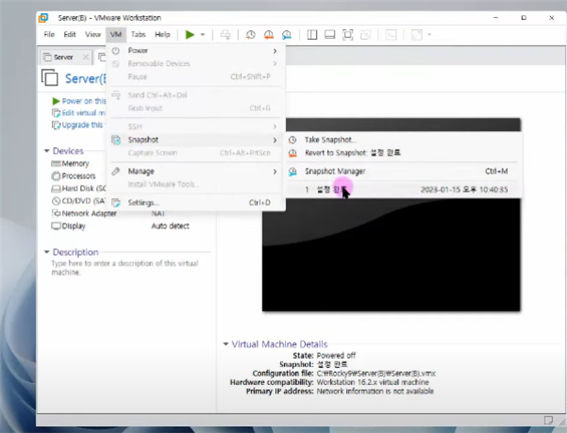

### 6. 런레벨

init 명령어 뒤에 붙는 숫자를 런레벨이라고 부릅니다.

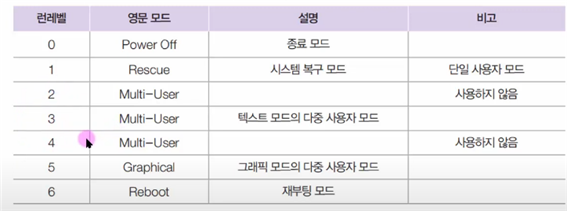

런레벨 모드를 확인하려면 /lib/systemd/system 디렉터리의 runlevel?.target파일을 확인

### 7. 자동완성 기능

자동완성이란 파일명의 일부만 입력한 후에 Tab키를 눌러 자동 완성하는 기능
후보군이 여러 개인 경우 확인을 위해 Tab키를 한 번 더 눌러야 한다.

### 8. 도스키

도스키란 이전에 입력한 명령어를 화살표 위아래를 이용하여 설정하는 것.

### 9. VI 에디터 사용법 개요도

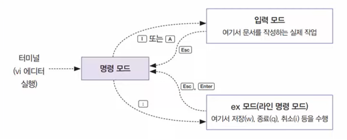

### 10. vi 기능 요약
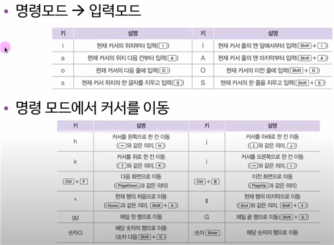
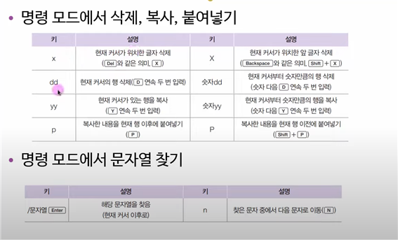

### 11. 도움말 기능

리눅스 및 유닉스 기반 시스템에서 `man` 명령어를 사용하면 매뉴얼 페이지(도움말)를 열 수 있습니다. `man` 명령어는 "manual"의 줄임말로, 명령어나 프로그램에 대한 자세한 설명을 확인할 때 유용합니다.

예를 들어, 특정 명령어에 대한 도움말을 보려면 아래와 같이 입력할 수 있습니다:

```bash
man [명령어]
```

예를 들어 `ls` 명령어의 매뉴얼을 보려면:

```bash
man ls
```

화면이 텍스트 기반으로 전환되며 해당 명령어에 대한 상세한 설명과 옵션 등을 확인할 수 있습니다. 매뉴얼 페이지를 나가려면 `q` 키를 누르면 됩니다.

`man` 명령어를 통해 시스템에서 사용 가능한 명령어와 프로그램에 대한 도움말을 쉽게 찾고 사용할 수 있습니다.

### 12. CD/DVD 마운트

CD 또는 DVD를 마운트하려면 일반적으로 다음과 같은 단계를 따릅니다. 마운트는 파일 시스템을 특정 디렉토리에 연결하는 과정입니다.

1. **마운트 포인트 생성:**
   - CD 또는 DVD를 마운트할 디렉토리를 생성합니다. 예를 들면 `/mnt/cdrom`과 같이 원하는 디렉토리를 지정할 수 있습니다.

    ```bash
    sudo mkdir /mnt/cdrom
    ```

2. **마운트 명령어 사용:**
   - 마운트 명령어를 사용하여 CD 또는 DVD를 마운트합니다. 여기서는 `/dev/cdrom`을 예로 들겠습니다.

    ```bash
    sudo mount /dev/cdrom /mnt/cdrom
    ```

   만약 DVD라면 `/dev/dvd`나 `/dev/sr0` 등의 장치도 사용될 수 있습니다. 마운트 포인트와 장치는 시스템에 따라 다를 수 있습니다.

3. **마운트 확인:**
   - 마운트가 정상적으로 이루어졌는지 확인합니다.

    ```bash
    df -h
    ```

   위 명령어를 통해 마운트된 파일 시스템을 확인할 수 있습니다.

4. **마운트 해제(Unmount):**
   - 사용이 끝난 후에는 마운트를 해제합니다.

    ```bash
    sudo umount /mnt/cdrom
    ```

   장치를 안전하게 제거하려면 마운트를 해제한 후에 꼭 `umount` 명령어를 사용해야 합니다.

### 13. 리눅스 기본 명령어 모음

리눅스 기본 명령어들 입니다. 이 명령어들은 터미널에서 사용되며, 시스템 관리, 파일 및 디렉토리 작업, 프로세스 관리 등 다양한 작업을 수행하는 데 사용됩니다. 명령어 뒤에 `--help`나 `man`을 사용하여 자세한 도움말을 확인할 수 있습니다.

1. **파일 및 디렉토리 관리:**
   - `ls`: 디렉토리 내용 나열
   - `cd`: 디렉토리 변경
   - `pwd`: 현재 작업 디렉토리 출력
   - `cp`: 파일 또는 디렉토리 복사
   - `mv`: 파일 또는 디렉토리 이동 또는 이름 변경
   - `rm`: 파일 또는 디렉토리 삭제
   - `mkdir`: 디렉토리 생성

2. **파일 검색 및 편집:**
   - `find`: 파일 검색
   - `grep`: 파일 내에서 문자열 검색
   - `cat`: 파일 내용 출력
   - `nano` 또는 `vim`: 텍스트 파일 편집기

3. **시스템 및 하드웨어 정보:**
   - `uname`: 시스템 정보 출력
   - `top` 또는 `htop`: 시스템 리소스 모니터링
   - `df`: 디스크 여유 공간 확인
   - `du`: 디렉토리 크기 확인

4. **사용자 및 권한 관리:**
   - `who`: 현재 로그인한 사용자 출력
   - `useradd`: 사용자 추가
   - `passwd`: 사용자 비밀번호 변경
   - `chmod`: 파일 권한 변경
   - `chown`: 파일 소유자 및 그룹 변경

5. **프로세스 관리:**
   - `ps`: 현재 실행 중인 프로세스 목록 출력
   - `kill`: 프로세스 종료
   - `killall`: 특정 프로세스명으로 여러 프로세스 종료

6. **네트워크 관리:**
   - `ifconfig` 또는 `ip`: 네트워크 인터페이스 정보 확인
   - `ping`: 네트워크 호스트 테스트
   - `netstat`: 네트워크 연결 및 통계 정보 출력

7. **파일 압축 및 해제:**
   - `tar`: 파일 압축 및 해제
   - `gzip`, `bzip2`: 파일 압축 및 해제

8. **패키지 관리 (일부 배포판에 해당):**
   - `apt`, `apt-get`: Debian 계열 패키지 관리자
   - `yum`, `dnf`: Red Hat 계열 패키지 관리자

9. **기타:**
   - `date`: 시스템 날짜 및 시간 출력
   - `echo`: 메시지 출력
   - `history`: 명령어 실행 히스토리 출력
   - `shutdown` 또는 `reboot`: 시스템 종료 또는 재부팅

이 명령어들은 리눅스 시스템에서 기본적으로 사용되는 것들 중 일부이며, 각 명령어에 대한 자세한 정보는 해당 명령어 뒤에 `--help`나 `man`을 붙여서 확인할 수 있습니다.

### 14. 사용자 그룹

리눅스에서 사용자와 그룹을 관리하는 명령어들은 시스템의 보안 및 권한 관리에 중요한 역할을 합니다. 

1. **사용자 관리:**
   - `useradd`: 새로운 사용자 추가
     ```bash
     sudo useradd [사용자명]
     ```

   - `passwd`: 사용자 비밀번호 설정 또는 변경
     ```bash
     sudo passwd [사용자명]
     ```

   - `userdel`: 사용자 삭제
     ```bash
     sudo userdel [사용자명]
     ```

   - `usermod`: 사용자 속성 변경 (예: 그룹 변경)
     ```bash
     sudo usermod -G [그룹명] [사용자명]
     ```

   - `id`: 사용자 및 그룹의 식별자 출력
     ```bash
     id [사용자명]
     ```

2. **그룹 관리:**
   - `groupadd`: 새로운 그룹 추가
     ```bash
     sudo groupadd [그룹명]
     ```

   - `groupdel`: 그룹 삭제
     ```bash
     sudo groupdel [그룹명]
     ```

   - `gpasswd`: 그룹에 사용자 추가 또는 제거
     ```bash
     sudo gpasswd -a [사용자명] [그룹명]
     sudo gpasswd -d [사용자명] [그룹명]
     ```

   - `newgrp`: 현재 쉘 세션에서 다른 그룹으로 전환
     ```bash
     newgrp [그룹명]
     ```

3. **사용자 및 그룹 확인:**
   - `who`: 현재 로그인한 사용자 확인
     ```bash
     who
     ```

   - `groups`: 사용자가 속한 그룹 확인
     ```bash
     groups [사용자명]
     ```

   - `cat /etc/passwd`: 사용자 계정 정보 파일 출력
     ```bash
     cat /etc/passwd
     ```

   - `cat /etc/group`: 그룹 정보 파일 출력
     ```bash
     cat /etc/group
     ```

4. **su (Switch User):**
   - `su`: 다른 사용자로 전환
     ```bash
     su [사용자명]
     ```

   - `su -`: 환경 변수와 함께 다른 사용자로 전환
     ```bash
     su - [사용자명]
     ```

이러한 명령어들은 사용자 및 그룹을 관리하고 권한을 설정하는 데 사용됩니다. 명령어 사용 시 주의가 필요하며, 일부 명령은 `sudo`를 사용하여 관리자 권한으로 실행해야 합니다.

### 15. 파일 리스트와 파일 속성

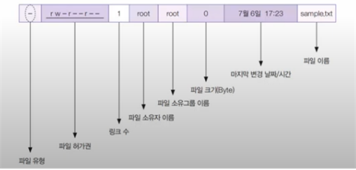

### 16. 파일 허가권

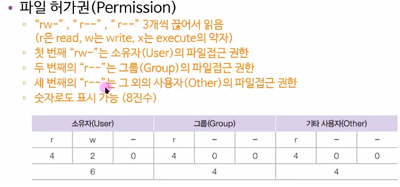

### 17. 파일 소유와 허가권에 관련된 명령어들

리눅스에서 파일과 디렉토리의 소유자와 허가권을 관리하는 명령어들은 시스템 보안 및 권한 설정에 중요한 역할을 합니다. 

1. **chown (Change Owner):**
   - 파일이나 디렉토리의 소유자를 변경합니다.
     ```bash
     sudo chown [새로운소유자]:[새로운그룹] [파일 또는 디렉토리]
     ```

2. **chgrp (Change Group):**
   - 파일이나 디렉토리의 그룹을 변경합니다.
     ```bash
     sudo chgrp [새로운그룹] [파일 또는 디렉토리]
     ```

3. **chmod (Change Mode):**
   - 파일 또는 디렉토리의 허가권을 변경합니다.
     ```bash
     sudo chmod [권한] [파일 또는 디렉토리]
     ```

   허가권은 숫자로도 표현 가능합니다. 예를 들어, `sudo chmod 755 filename`는 소유자에게 읽기, 쓰기, 실행 권한을 주고, 그룹과 다른 사용자에게는 읽기 및 실행 권한만을 부여합니다.

4. **umask:**
   - 새로운 파일을 만들 때 기본 허가권을 설정합니다.
     ```bash
     umask [허가권]
     ```

   `umask`는 일반적으로 022 또는 002로 설정되어 있으며, 이는 새 파일의 기본 허가권에서 각각 022(모든 사용자에게 쓰기 권한 제거) 또는 002(다른 사용자에게 쓰기 권한 제거)를 뺀 값이 됩니다.

5. **ls:**
   - 파일 및 디렉토리의 허가권과 소유자 정보를 확인합니다.
     ```bash
     ls -l [파일 또는 디렉토리]
     ```

   `ls -l` 명령어는 자세한 리스트를 보여주어 파일의 허가권, 소유자, 그룹 등을 확인할 수 있습니다.

이러한 명령어들을 사용하여 파일 및 디렉토리의 소유자와 허가권을 효과적으로 관리할 수 있습니다. 파일과 디렉토리의 권한을 신중하게 관리하여 시스템 보안을 유지할 수 있습니다.

### 18. 파일의 링크

파일의 링크는 주로 하드 링크(hard link)와 심볼릭 링크(symbolic link 또는 soft link)로 나눌 수 있습니다.

1. **하드 링크 (Hard Link):**
   - 동일한 파일에 대한 다른 파일 경로를 생성하는 것입니다.
   - 원본 파일과 링크 간에는 데이터가 실제로 중복되지 않습니다.
   - 원본 파일이나 링크 중 하나를 수정하면 나머지도 같이 변경됩니다.
   - 파일 시스템이 지원해야 하며, 디렉토리에 대한 하드 링크는 지원되지 않습니다.

   하드 링크 생성:
   ```bash
   ln [원본파일] [링크파일]
   ```

2. **심볼릭 링크 (Symbolic Link 또는 Soft Link):**
   - 원본 파일에 대한 포인터 역할을 하는 새로운 파일을 생성합니다.
   - 원본 파일이나 링크를 수정하면 다른 파일에는 영향이 없습니다.
   - 디렉토리에 대한 심볼릭 링크도 생성 가능합니다.
   - 링크된 파일이나 디렉토리가 삭제되면 링크는 무효화됩니다.

   심볼릭 링크 생성:
   ```bash
   ln -s [원본파일] [링크파일]
   ```

   `-s` 옵션은 심볼릭 링크를 생성하도록 지정합니다.

하드 링크와 심볼릭 링크는 각각의 특성에 따라 사용 목적이 다를 수 있습니다. 일반적으로 하드 링크는 동일한 파일의 여러 이름이 필요한 경우 사용되고, 심볼릭 링크는 파일이나 디렉토리에 대한 포인터가 필요한 경우 사용됩니다.

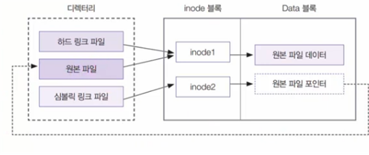

### 19. 프로그램 설치를 위한 RPM 명령어

RPM (Red Hat Package Manager)은 Red Hat 계열의 리눅스 배포판에서 사용되는 소프트웨어 패키지 관리 도구입니다. RPM을 사용하여 프로그램을 설치, 업데이트, 제거할 수 있습니다.

1. **패키지 설치:**
   ```bash
   rpm -ivh 패키지이름.rpm
   ```
   - `-i`: 설치 옵션
   - `-v`: 자세한 출력 활성화
   - `-h`: 설치 진행 상태를 해시 표시로 표시

2. **패키지 업데이트:**
   ```bash
   rpm -Uvh 패키지이름.rpm
   ```
   - `-U`: 업그레이드 옵션

3. **패키지 제거:**
   ```bash
   rpm -ev 패키지이름
   ```
   - `-e`: 제거 옵션

4. **패키지 정보 표시:**
   ```bash
   rpm -qi 패키지이름
   ```
   - `-q`: 쿼리 옵션
   - `-i`: 패키지 정보 표시

5. **모든 설치된 패키지 목록 표시:**
   ```bash
   rpm -qa
   ```
   - `-qa`: 모든 패키지 쿼리

6. **패키지 검색:**
   ```bash
   rpm -q 패키지이름
   ```
   - `-q`: 패키지 쿼리

7. **패키지 파일의 소유자 확인:**
   ```bash
   rpm -qf 파일경로
   ```
   - `-qf`: 파일 쿼리

이 명령어들은 기본적인 RPM 패키지 관리 작업을 수행합니다. 패키지 관리는 주로 `yum`이나 `dnf`와 같은 고수준 패키지 관리 도구를 사용하여 진행하는 것이 일반적이지만, RPM을 직접 사용해야 하는 경우에 위의 명령어들을 활용할 수 있습니다.

### 20. DNF 란 무엇인가?

DNF(또는 Dandified YUM)는 Fedora와 Red Hat 계열의 리눅스에서 사용되는 고급 패키지 관리 도구입니다. DNF는 YUM(Yellowdog Updater, Modified)을 대체하며, YUM의 기능을 유지하면서 빠르고 효율적인 패키지 관리를 제공합니다.

### DNF의 주요 특징:

1. **성능 향상:**
   - DNF는 YUM보다 빠른 성능을 제공합니다. 더 효율적인 의존성 해결 및 저장소 캐싱을 통해 패키지 설치 및 업데이트를 빠르게 수행할 수 있습니다.

2. **역동적인 의존성 해결:**
   - 더 역동적인 의존성 해결 기능을 가지고 있어서 사용자에게 더 유연한 패키지 관리를 제공합니다.

3. **트랜잭션 히스토리:**
   - DNF는 시스템의 트랜잭션 히스토리를 기록하여 사용자가 시스템 변경 사항을 쉽게 추적할 수 있도록 합니다.

### DNF의 기본적인 사용법:

1. **패키지 설치:**
   ```bash
   sudo dnf install 패키지이름
   ```

2. **패키지 업데이트:**
   ```bash
   sudo dnf update 패키지이름
   ```

3. **패키지 제거:**
   ```bash
   sudo dnf remove 패키지이름
   ```

4. **모든 패키지 업데이트:**
   ```bash
   sudo dnf upgrade
   ```

5. **패키지 검색:**
   ```bash
   dnf search 검색어
   ```

6. **리포지터리 목록 확인:**
   ```bash
   dnf repolist
   ```

7. **의존성 문제 해결 없이 패키지 설치 (force):**
   ```bash
   sudo dnf install --nobest 패키지이름
   ```

8. **트랜잭션 히스토리 확인:**
   ```bash
   sudo dnf history
   ```

9. **그룹 패키지 설치:**
   ```bash
   sudo dnf group install "그룹이름"
   ```

10. **저장소 정보 확인:**
    ```bash
    sudo dnf repoinfo
    ```

이 외에도 DNF에는 다양한 옵션과 기능이 있으며, 자세한 내용은 `man dnf` 명령어나 `dnf --help`를 통해 확인할 수 있습니다. DNF는 리눅스 시스템에서 패키지 관리를 할 때 매우 유용한 도구 중 하나입니다.

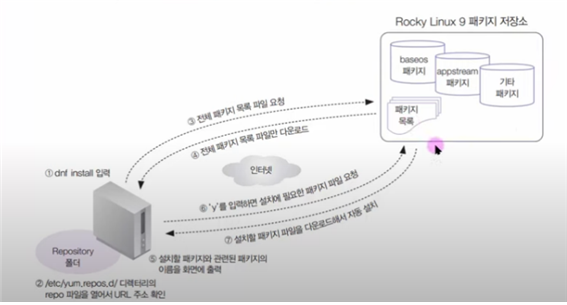

### 21. 파일 묶기

`tar` 명령어는 리눅스와 유닉스 기반 시스템에서 파일 및 디렉토리를 묶거나 압축하는 데 사용되는 명령어입니다. `tar` 명령어의 주요 동작은 `c` (생성), `x` (추출), `t` (목록)입니다. 또한, 파일을 압축하거나 해제할 때 사용되는 여러 옵션이 있습니다.

### 기본적인 `tar` 명령어 형식:

```bash
tar [동작] [옵션] [파일 또는 디렉토리]
```

### 주요 동작:

1. **파일 묶기 (Create):**
   ```bash
   tar -cvf 압축파일.tar 파일1 파일2 디렉토리1 디렉토리2
   ```
   - `-c`: 파일을 묶기(create)
   - `-v`: 자세한 출력(verbose)
   - `-f`: 파일 지정

2. **파일 압축 해제 (eXtract):**
   ```bash
   tar -xvf 압축파일.tar
   ```
   - `-x`: 파일을 해제(extract)
   - `-v`: 자세한 출력(verbose)
   - `-f`: 파일 지정

3. **파일 목록 확인 (lisT):**
   ```bash
   tar -tvf 압축파일.tar
   ```
   - `-t`: 목록 표시(list)
   - `-v`: 자세한 출력(verbose)
   - `-f`: 파일 지정

### 주요 옵션:

- **`-f` 옵션:**
   - `tar -cf 압축파일.tar 파일1 파일2`: 파일 묶기
   - `tar -xf 압축파일.tar`: 파일 압축 해제
   - `tar -tf 압축파일.tar`: 파일 목록 확인

- **`-v` 옵션:**
   - 자세한 출력 모드로 실행할 때 사용합니다.
   - `tar -cvf 압축파일.tar 파일1 파일2`: 파일 묶기 (자세한 출력)
   - `tar -xvf 압축파일.tar`: 파일 압축 해제 (자세한 출력)
   - `tar -tvf 압축파일.tar`: 파일 목록 확인 (자세한 출력)

- **`-J` (또는 `--xz`), `-z` (또는 `--gzip`), `-j` (또는 `--bzip2`) 옵션:**
   - 파일을 각각 xz, gzip, bzip2로 압축합니다.
   - `tar -cvfJ 압축파일.tar.xz 파일1 파일2`: xz로 압축하여 파일 묶기
   - `tar -xvfJ 압축파일.tar.xz`: xz 압축 해제
   - `tar -cvfz 압축파일.tar.gz 파일1 파일2`: gzip으로 압축하여 파일 묶기
   - `tar -xvfz 압축파일.tar.gz`: gzip 압축 해제
   - `tar -cvfj 압축파일.tar.bz2 파일1 파일2`: bzip2로 압축하여 파일 묶기
   - `tar -xvfj 압축파일.tar.bz2`: bzip2 압축 해제

`tar` 명령어는 유연하게 사용할 수 있으며, 다양한 옵션을 조합하여 필요에 맞게 활용할 수 있습니다.

### 22. 파일 위치 검색

파일이나 디렉토리를 검색하는 명령어들은 리눅스 및 유닉스 기반 시스템에서 자주 사용됩니다. 

### 1. `find` 명령어:

`find` 명령어는 파일 시스템을 탐색하여 파일이나 디렉토리를 찾습니다.

**사용법:**
```bash
find [경로] [옵션] [조건] [action]
```

**예시:**
- `/home` 디렉토리 아래에서 이름이 "example.txt"인 파일 찾기:
  ```bash
  find /home -name "example.txt"
  ```

### 2. `which` 명령어:

`which` 명령어는 지정된 명령어의 위치를 찾습니다.

**사용법:**
```bash
which [실행파일이름]
```

**예시:**
- "python" 명령어의 위치 찾기:
  ```bash
  which python
  ```

### 3. `whereis` 명령어:

`whereis` 명령어는 명령어, 소스 코드, 매뉴얼 페이지 등을 찾습니다.

**사용법:**
```bash
whereis [실행파일이름]
```

**예시:**
- "python" 명령어와 관련된 파일 위치 찾기:
  ```bash
  whereis python
  ```

### 4. `locate` 명령어:

`locate` 명령어는 데이터베이스를 사용하여 파일을 빠르게 찾습니다. 주로 미리 색인을 만들어놓고 사용합니다.

**사용법:**
```bash
locate [파일이름]
```

**예시:**
- "example.txt" 파일 위치 찾기:
  ```bash
  locate example.txt
  ```

이 명령어들을 사용하면 특정 파일이나 명령어의 위치를 쉽게 찾을 수 있습니다. 주의할 점은 `locate` 명령어는 주기적으로 데이터베이스를 업데이트해야 최신 정보를 얻을 수 있습니다. 데이터베이스 업데이트는 `updatedb` 명령어로 수행할 수 있습니다.

### 23. 시스템 설정 관련 명령어

리눅스 시스템 설정을 위해 몇 가지 유용한 명령행 도구와 그래피컬 도구들이 있습니다. 

### 1. `nmtui` (Network Manager Text User Interface):

`nmtui`는 텍스트 기반의 네트워크 관리 도구로, 네트워크 연결을 설정하고 관리할 수 있습니다.

**사용법:**
```bash
nmtui
```

### 2. `firewall-config` (Firewall Configuration):

`firewall-config`는 그래픽 환경에서 방화벽 설정을 관리하는 도구입니다. 일부 시스템에서는 `firewalld`를 사용하며, 이를 통해 방화벽 규칙을 관리할 수 있습니다.

**사용법:**
```bash
firewall-config
```

### 3. `ntsysv` (Text-based Interface for chkconfig):

`ntsysv`는 텍스트 기반의 서비스 관리 도구로, 시스템 부팅 시 자동으로 시작되는 서비스를 선택할 수 있습니다.

**사용법:**
```bash
ntsysv
```

### 4. `system-config-date` (System Date and Time):

`system-config-date`는 그래픽 환경에서 시스템의 날짜와 시간 설정을 관리하는 도구입니다.

**사용법:**
```bash
system-config-date
```

### 5. `system-config-users` (User Manager):

`system-config-users`는 그래픽 환경에서 사용자 계정을 추가하고 관리하는 도구입니다.

**사용법:**
```bash
system-config-users
```

### 6. `system-config-firewall` (Firewall Configuration):

`system-config-firewall`은 그래픽 환경에서 방화벽 설정을 관리하는 도구로, `firewall-config`와 비슷한 목적을 갖고 있습니다.

**사용법:**
```bash
system-config-firewall
```

### 24. CRON 과 AT

`cron`과 `at`은 리눅스와 유닉스 기반 시스템에서 주기적인 작업을 예약하고 실행하는데 사용되는 도구입니다.

### 1. `cron`:

`cron`은 주기적으로 실행되는 작업을 예약하는 데 사용되는 스케줄러입니다. 특정 시간에 특정 명령어 또는 스크립트를 실행할 수 있습니다.

**기본 사용법:**
1. **사용자 cron 편집:**
   ```bash
   crontab -e
   ```
   사용자의 cron 편집기가 열리고, 작업을 추가 또는 편집할 수 있습니다.

2. **시스템 cron 편집:**
   ```bash
   sudo crontab -e
   ```
   시스템 전체의 cron 편집기를 열어 시스템 수준의 작업을 추가 또는 편집할 수 있습니다.

**예시:**
- 매일 오전 3시에 스크립트 실행:
  ```bash
  0 3 * * * /path/to/script.sh
  ```

### 2. `at`:

`at`은 일회성으로 특정 시간에 작업을 예약하는 데 사용됩니다.

**기본 사용법:**
1. **명령어 실행 예약:**
   ```bash
   at [시간]
   ```
   그 후에 실행할 명령어를 입력하고 `Ctrl + D`로 종료합니다.

**예시:**
- 10분 후에 스크립트 실행:
  ```bash
  at now + 10 minutes
  ```
  그 후에 실행할 명령어를 입력하고 `Ctrl + D`로 종료합니다.

이러한 도구들은 자동화된 작업을 관리하고 예약할 때 유용하며, 서버 관리 및 정기적인 작업 스케줄링에 활용됩니다. 작업 스케줄러의 설정은 주기적인 유지보수 및 자동화에 큰 도움이 됩니다.


### 25. 네트워크 관련 필수 개념

1. TCP/IP (Transmission Control Protocol/Internet Protocol):

TCP/IP는 인터넷을 포함한 네트워크에서 데이터를 전송하기 위한 프로토콜 스위트입니다. 주요 프로토콜로는 IP (Internet Protocol), TCP (Transmission Control Protocol), UDP (User Datagram Protocol), ICMP (Internet Control Message Protocol) 등이 있습니다. TCP/IP는 계층적인 구조로 이루어져 있으며, 주로 4개의 계층으로 나뉩니다: 응용 계층, 전송 계층, 인터넷 계층, 네트워크 액세스 계층.

 2. 호스트 이름과 도메인 이름:

- **호스트 이름:** 네트워크에서 식별되는 개별 컴퓨터의 이름입니다.
- **도메인 이름:** 호스트 이름이 속한 도메인을 나타냅니다. 도메인은 계층적인 구조로 구성되어 있으며, 최상위 도메인 (TLD), 상위 도메인, 하위 도메인 등으로 이루어져 있습니다.

 3. IP 주소 (Internet Protocol Address):

IP 주소는 네트워크 상에서 각 기기를 식별하는 데 사용됩니다. IPv4와 IPv6가 있으며, 주로 IPv4 주소가 사용되고 있습니다.

 4. 네트워크 주소:

네트워크 주소는 IP 주소의 일부로, 해당 네트워크를 나타냅니다.

 5. 브로드캐스트 주소:

브로드캐스트 주소는 네트워크 상의 모든 호스트에게 데이터를 전송하는 데 사용되는 특수한 주소입니다.

 6. 게이트웨이:

게이트웨이는 서로 다른 네트워크 간에 데이터를 전송하는 장치입니다. 주로 라우터가 게이트웨이 역할을 합니다.

 7. 라우터:

라우터는 서로 다른 네트워크 간의 데이터 패킷을 전송하고 제어하는 장치입니다. 여러 네트워크 간에 데이터를 라우팅하며, 인터넷과 같은 대규모 네트워크에서 핵심 역할을 합니다.

 8. 넷마스크와 클래스:

넷마스크는 IP 주소를 하위 네트워크로 나누는 데 사용되는 마스크입니다. 클래스는 네트워크 주소의 범위를 나타내며, 주소 할당을 위해 A, B, C, D, E 클래스로 나뉩니다.

 9. DNS 서버 주소 (Domain Name System):

DNS는 호스트 이름과 도메인 이름을 IP 주소로 변환하고, 그 반대로 IP 주소를 호스트 이름과 도메인 이름으로 변환하는 데 사용됩니다. DNS 서버는 이러한 변환을 처리하고 관리합니다.

이러한 개념들은 네트워크의 구조와 동작을 이해하고 관리하는 데 중요한 역할을 합니다.

### 26. 중요한 네트워크 관련 명령어


 1. `nmtui` (Network Manager Text User Interface):

`nmtui`는 텍스트 기반의 네트워크 관리 도구로, 네트워크 연결을 설정하고 관리할 수 있습니다.

**사용법:**
```bash
nmtui
```

 2. `systemctl`:

`systemctl`은 systemd 서비스 및 다양한 시스템 관리 작업을 수행하는 데 사용됩니다.

- **시작 (start):**
  ```bash
  sudo systemctl start NetworkManager
  ```

- **중지 (stop):**
  ```bash
  sudo systemctl stop NetworkManager
  ```

- **재시작 (restart):**
  ```bash
  sudo systemctl restart NetworkManager
  ```

- **상태 확인 (status):**
  ```bash
  sudo systemctl status NetworkManager
  ```

 3. `ifconfig`:

`ifconfig`는 네트워크 인터페이스의 상태를 확인하고 설정하는 데 사용됩니다.

- **인터페이스 상태 확인:**
  ```bash
  ifconfig
  ```

- **특정 인터페이스 상태 확인:**
  ```bash
  ifconfig [인터페이스이름]
  ```

- **인터페이스 활성화:**
  ```bash
  sudo ifconfig [인터페이스이름] up
  ```

- **인터페이스 비활성화:**
  ```bash
  sudo ifconfig [인터페이스이름] down
  ```

 4. `ifup` 및 `ifdown`:

`ifup` 및 `ifdown` 명령어는 네트워크 인터페이스를 활성화하거나 비활성화하는 데 사용됩니다.

- **인터페이스 활성화:**
  ```bash
  sudo ifup [인터페이스이름]
  ```

- **인터페이스 비활성화:**
  ```bash
  sudo ifdown [인터페이스이름]
  ```

 5. `nslookup`:

`nslookup`은 도메인 이름에 대한 IP 주소를 조회하는 데 사용됩니다.

**사용법:**
```bash
nslookup [도메인이름]
```

 6. `ping`:

`ping`은 특정 호스트에 대한 응답 시간을 확인하는 데 사용됩니다.

**사용법:**
```bash
ping [IP주소 또는 도메인이름]
```

 7. 네트워크 설정과 관련된 주요 파일:

- **네트워크 설정 파일:**
   - `/etc/network/interfaces` (Debian 계열)
   - `/etc/sysconfig/network-scripts/ifcfg-인터페이스이름` (Red Hat 계열)

- **DNS 설정 파일:**
   - `/etc/resolv.conf`

- **호스트 이름 파일:**
   - `/etc/hostname` (호스트 이름 정보가 저장된 파일)

- **네트워크 서비스 파일:**
   - `/etc/services` (포트 및 서비스 이름 관련 정보)

이러한 명령어 및 파일들은 리눅스 시스템에서 네트워크 설정과 관련된 작업을 수행하는 데 사용됩니다. 다양한 배포판에서는 세부적인 파일 및 명령어의 경로가 다를 수 있습니다.

### 27. 네트워크 보안을 위한 SELinux

SELinux(SeLinux Security Enhanced Linux)는 리눅스 시스템의 보안 강화를 위한 제어 매커니즘 중 하나입니다. SELinux는 기본적으로 Red Hat 계열의 리눅스 배포판, CentOS 등에서 사용되고 있습니다. SELinux는 각 프로세스 및 사용자에 대한 엑세스 권한을 세밀하게 제어하여 시스템 보안을 강화합니다.

SELinux를 활성화하거나 비활성화하려면 다음 명령어를 사용할 수 있습니다:

### SELinux 활성화:

```bash
sudo setenforce 1
```

또는

```bash
sudo enforcing
```

### SELinux 비활성화:

```bash
sudo setenforce 0
```

또는

```bash
sudo permissive
```

### SELinux 상태 확인:

```bash
sestatus
```

### SELinux 보안 정책 변경:

`/etc/selinux/config` 파일을 수정하여 SELinux 보안 정책을 변경할 수 있습니다. 이 파일을 수정하여 `SELINUX` 항목의 값을 `enforcing` 또는 `permissive`로 변경하고, 변경을 적용하기 위해 시스템을 다시 부팅해야 합니다.

### SELinux 그래픽 도구(system-config-selinux):

`system-config-selinux`은 그래픽 환경에서 SELinux 설정을 관리하는 도구입니다. 그래픽 환경을 사용하는 경우에 유용합니다.

**사용법:**

```bash
sudo system-config-selinux
```

이 명령을 실행하면 SELinux 설정을 그래픽 환경에서 변경할 수 있는 인터페이스가 표시됩니다. 설정 변경 후에는 변경 사항을 적용하기 위해 시스템을 다시 부팅해야 합니다.

SELinux는 강력한 보안 기능을 제공하지만, 적절한 정책을 설정하지 않으면 예상치 못한 문제가 발생할 수 있습니다. 따라서 SELinux를 변경할 때는 신중하게 검토하고 테스트하는 것이 중요합니다.

### 28. 파이프, 필터, 리디렉션 명령어

**파이프 (|):** 파이프는 리눅스/유닉스 환경에서 두 개의 명령어를 연결하여 하나의 명령어의 출력을 다른 명령어의 입력으로 전달하는 데 사용됩니다. 이를 통해 여러 명령어를 조합하여 복잡한 작업을 수행할 수 있습니다.

**예시:**
```bash
command1 | command2
```

이렇게 하면 `command1`의 출력이 `command2`의 입력으로 전달됩니다.

**필터 명령어:**
- **`grep`:** 텍스트에서 특정 패턴을 검색하는 데 사용됩니다.
  ```bash
  grep "pattern" filename
  ```

- **`tail`:** 파일의 끝 부분을 출력하는 데 사용됩니다.
  ```bash
  tail filename
  ```

- **`wc`:** 파일의 행, 단어 및 문자 수를 세는 데 사용됩니다.
  ```bash
  wc filename
  ```

- **`sort`:** 텍스트를 정렬하는 데 사용됩니다.
  ```bash
  sort filename
  ```

- **`awk`:** 텍스트 데이터를 처리하고 보고서를 생성하는 데 사용됩니다.
  ```bash
  awk '{print $2}' filename
  ```

- **`sed`:** 텍스트에서 패턴을 검색하고 치환하는 데 사용됩니다.
  ```bash
  sed 's/old-pattern/new-pattern/' filename
  ```

**리디렉션:**
- **`>` :** 표준 출력을 파일로 리디렉션합니다.
  ```bash
  command > outputfile
  ```

- **`>>`:** 표준 출력을 파일에 추가합니다.
  ```bash
  command >> outputfile
  ```

- **`<` :** 파일의 내용을 표준 입력으로 가져옵니다.
  ```bash
  command < inputfile
  ```

이러한 명령어와 기법을 조합하면 다양한 작업을 수행할 수 있습니다. 예를 들어, `ps aux | grep "process" | awk '{print $2}' > process_ids.txt`와 같이 사용하여 프로세스 ID를 찾고 파일로 저장할 수 있습니다.

### 29. 프로세스 관리

리눅스 및 유닉스 기반 시스템에서 프로세스 관리에는 포그라운드(Foreground)와 백그라운드(Background)의 개념이 있습니다. 여기에는 프로세스 번호와 작업 번호도 연관되어 있습니다.

 1. 포그라운드 프로세스 (Foreground Process):

포그라운드 프로세스는 현재 사용자와 상호 작용하는 프로세스입니다. 터미널에서 명령어를 실행하면 해당 명령이 포그라운드에서 실행되며, 명령이 완료될 때까지 터미널은 그 명령어의 출력을 받아들입니다. 일반적으로 대부분의 명령어는 포그라운드에서 실행됩니다.

 2. 백그라운드 프로세스 (Background Process):

백그라운드 프로세스는 사용자와의 상호 작용 없이 실행되는 프로세스입니다. 명령어를 실행할 때 명령어 뒤에 `&`를 붙이면 해당 명령은 백그라운드에서 실행됩니다. 이 경우 터미널은 다른 명령을 입력받을 수 있습니다.

**예시:**
```bash
command &
```

 3. 프로세스 번호 (Process ID - PID):

프로세스 번호는 각 프로세스에 할당된 고유한 숫자입니다. `ps` 명령어를 사용하여 현재 실행 중인 프로세스의 목록과 각 프로세스의 PID를 확인할 수 있습니다.

**예시:**
```bash
ps aux
```

 4. 작업 번호 (Job Number):

작업 번호는 터미널에서 실행한 명령어의 순서에 따라 할당되는 번호입니다. 백그라운드에서 실행한 명령에 대해 작업 번호를 사용하여 해당 작업을 관리할 수 있습니다.

**작업 백그라운드로 보내기:**
```bash
command &
```

**작업 확인:**
```bash
jobs
```

**작업 포그라운드로 가져오기:**
```bash
fg %작업번호
```

**작업 백그라운드로 보내기:**
```bash
bg %작업번호
```

이러한 개념들은 사용자가 리눅스 터미널에서 명령어를 실행하고 관리할 때 중요합니다. 각각의 명령어와 특성을 이해하면 효율적으로 작업을 수행할 수 있습니다.

### 30. 서비스와 소켓

서비스와 소켓은 리눅스 시스템에서 특히 systemd와 관련된 용어로 사용됩니다.

 1. 서비스 (Service):

서비스는 시스템에서 백그라운드에서 실행되는 프로세스를 나타냅니다. 주로 특정 기능이나 서비스를 제공하는 데 사용되며, 웹 서버 (예: Apache), 데이터베이스 서버 (예: MySQL), 파일 전송 프로토콜 서버 (예: FTP), 로그인 관리 서비스 (예: SSH) 등이 서비스의 예시입니다. systemd에서는 이러한 서비스를 관리하기 위해 서비스 유닛을 사용합니다.

서비스의 시작, 중지, 재시작, 상태 확인 등의 작업은 `systemctl` 명령어를 통해 수행할 수 있습니다.

**예시:**
```bash
sudo systemctl start apache2  # 아파치 웹 서버 시작
sudo systemctl stop apache2   # 아파치 웹 서버 중지
sudo systemctl restart apache2  # 아파치 웹 서버 재시작
sudo systemctl status apache2   # 아파치 웹 서버 상태 확인
```

 2. 소켓 (Socket):

소켓은 외부에서 특정 서비스에 접속하거나 서비스에 요청을 보낼 때 사용되는 네트워크 소켓을 의미합니다. systemd에서는 소켓 유닛을 통해 소켓을 관리하고, 요청이 들어오면 서비스를 구동하여 해당 요청을 처리합니다.

서비스가 항상 가동되어 있어야 하는 반면, 소켓은 필요할 때만 활성화되고 서비스가 구동됩니다. 이것은 특히 네트워크 서비스에서 유용하게 활용됩니다.

**예시:**
```bash
sudo systemctl start apache2.socket  # 아파치 웹 서버 소켓 시작
sudo systemctl stop apache2.socket   # 아파치 웹 서버 소켓 중지
sudo systemctl status apache2.socket  # 아파치 웹 서버 소켓 상태 확인
```

이러한 서비스와 소켓은 systemd에서 제공하는 기능으로, 시스템의 시작 및 운영을 효과적으로 관리할 수 있게 해줍니다.

### 31. 응급 복구

시스템이 접속이 되지 않을 때 응급 복구를 수행하는 것은 시스템 관리자에게 중요한 기술입니다. 

1. **부팅 과정 확인:**
   - 시스템이 부팅 중에 에러 메시지를 확인합니다. 부팅 중에 문제가 발생한 경우, 에러 메시지는 문제 해결에 유용한 정보를 제공할 수 있습니다.
   - 부팅 중에 `Ctrl + Alt + F1` 또는 `Ctrl + Alt + F2` 등을 눌러 가상 콘솔로 이동하여 로그인을 시도하고 에러 메시지를 확인할 수 있습니다.

2. **단일 사용자 모드(Single User Mode)로 부팅:**
   - 부팅 중에 GRUB 메뉴에서 리눅스 커널을 선택하고 `e` 키를 누릅니다.
   - `ro` 뒤에 있는 `single`을 입력하여 단일 사용자 모드로 부팅합니다.
   - 부팅이 완료되면 루트 권한으로 로그인하고 문제를 해결합니다.

3. **파일 시스템 점검:**
   - 시스템이 부팅 중에 파일 시스템 점검이 필요한 경우, 부팅 중에 `Ctrl + D`를 눌러 점검을 건너뛰지 않고 수행합니다.
   - 부팅 중에 `Ctrl + Alt + F1`로 이동하여 루트 권한으로 로그인한 후, 다음 명령어를 사용하여 파일 시스템을 점검합니다.
     ```bash
     fsck -f /dev/sdXn  # X는 디스크 번호, n은 파티션 번호
     ```

4. **네트워크 상태 확인:**
   - 네트워크 문제로 인해 시스템에 접속할 수 없는 경우, 네트워크 설정 및 연결을 확인합니다.
   - IP 주소, 게이트웨이, DNS 등의 설정을 확인하고 필요한 경우 수정합니다.

5. **로그 확인:**
   - `/var/log` 디렉터리에 있는 로그 파일들을 확인하여 시스템 로그 및 서비스 로그를 분석합니다.
   - `dmesg` 명령어로 시스템 메시지를 확인하거나, `journalctl` 명령어로 systemd의 로그를 확인할 수 있습니다.

6. **시스템 상태 복구:**
   - 문제를 해결한 후, 시스템을 정상적으로 부팅할 수 있도록 조치합니다.
   - `reboot` 명령어로 시스템을 다시 부팅합니다.

### 32.GRUB 부트로더

GRUB (GRand Unified Bootloader)와 GRUB2는 리눅스와 다른 운영 체제를 부팅하는 데 사용되는 부트로더로서, 각각의 특징과 장점이 있습니다.

 GRUB (Legacy):

1. **쉽고 간단한 구성:**
   - GRUB Legacy는 상대적으로 간단하고 직관적인 설정을 제공합니다.

2. **텍스트 기반 메뉴:**
   - 부팅 시에 텍스트 기반의 부트 메뉴를 사용합니다.

3. **다양한 파일 시스템 지원:**
   - 다양한 파일 시스템을 지원하며, 다른 운영 체제와의 호환성이 높습니다.

 GRUB2:

1. **최신 기술 지원:**
   - GRUB2는 더 최신의 기술을 지원하며, UEFI (Unified Extensible Firmware Interface)와 GPT (GUID Partition Table) 등과 같은 현대적인 표준을 따릅니다.

2. **그래픽 및 테마 지원:**
   - GRUB2는 그래픽 기반의 부트 메뉴 및 다양한 테마를 지원하여 사용자 정의가 쉽습니다.

3. **부트 로더 스크립팅:**
   - GRUB2는 스크립트 언어를 사용하여 부팅 프로세스를 더 세밀하게 제어할 수 있도록 해줍니다.

4. **모듈화 및 확장성:**
   - GRUB2는 모듈화되어 있어 필요한 기능만을 로드하고 사용할 수 있으며, 이는 부트로더의 크기를 최적화하고 유연성을 높입니다.

5. **국제화 및 다국어 지원:**
   - GRUB2는 국제화 및 다국어 지원을 제공하여 다양한 언어로 사용자 인터페이스를 표시할 수 있습니다.

6. **부트 레거시 및 UEFI 지원:**
   - GRUB2는 레거시 BIOS 및 UEFI를 모두 지원하며, 이는 다양한 시스템에서 사용할 수 있도록 합니다.

7. **유연한 부팅 옵션 제공:**
   - GRUB2는 다양한 부팅 옵션을 제공하여 다른 커널 또는 부트 파라미터를 선택할 수 있습니다.

GRUB2는 더 현대적이고 유연한 부트로더로서, 다양한 환경에서 사용자 정의와 확장성을 높여줍니다. 따라서 대부분의 최신 리눅스 배포판에서는 GRUB2를 사용하고 있습니다.

### 33. 모듈

모듈은 프로그램이나 시스템의 일부로서, 필요할 때 호출되거나 로드되어 사용되는 코드의 논리적인 단위를 나타냅니다. 모듈은 주로 코드의 모듈화, 유지보수 용이성, 재사용성을 증가시키는 데 사용됩니다.

모듈은 다양한 형태로 나타날 수 있으며, 다양한 프로그래밍 환경에서 사용됩니다. 몇 가지 예시는 다음과 같습니다:

1. **프로그래밍 언어에서의 모듈:**
   - 많은 프로그래밍 언어에서 모듈은 코드를 논리적으로 그룹화하고 독립적으로 사용할 수 있는 단위를 나타냅니다. 예를 들어, Python에서는 `import` 키워드를 사용하여 모듈을 가져와서 사용할 수 있습니다.

    ```python
    # 모듈 가져오기
    import my_module

    # 모듈의 함수 호출
    my_module.my_function()
    ```

2. **커널에서의 모듈:**
   - 운영 체제 커널은 동적으로 로드되거나 언로드되는 커널 모듈을 사용할 수 있습니다. 리눅스에서는 `insmod`나 `modprobe`와 같은 명령어를 사용하여 커널 모듈을 로드하거나 언로드할 수 있습니다.

    ```bash
    # 커널 모듈 로드
    sudo modprobe my_module

    # 커널 모듈 언로드
    sudo modprobe -r my_module
    ```

3. **웹 개발에서의 모듈:**
   - 웹 개발에서는 모듈이 웹 서버에 추가되어 특정 기능을 확장하거나 미들웨어를 추가하는 데 사용될 수 있습니다.

    ```javascript
    // Node.js에서의 모듈 사용 예시
    const express = require('express');
    const app = express();

    // 라우팅 모듈 추가
    const routes = require('./routes');
    app.use('/api', routes);
    ```

모듈은 코드를 더 쉽게 관리하고 유지보수할 수 있게 해주며, 필요한 기능을 필요한 시점에 호출하여 사용할 수 있는 유연성을 제공합니다.

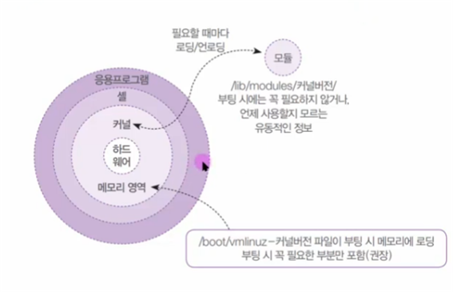

### 34. 커널 컴파일 순서

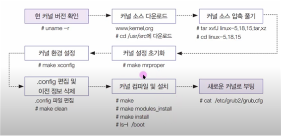