### 1.  하드웨어 구성도

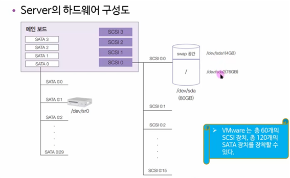

### 2. 디스크 추가하기

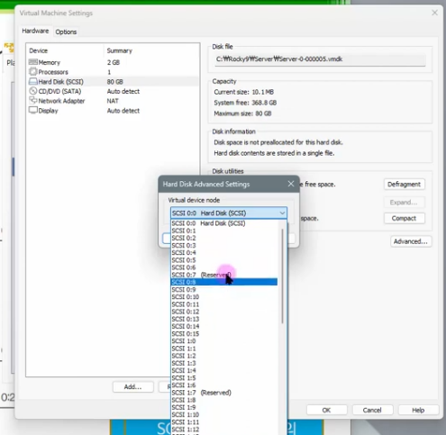
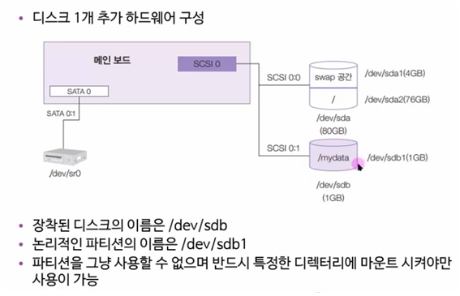
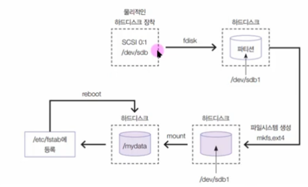
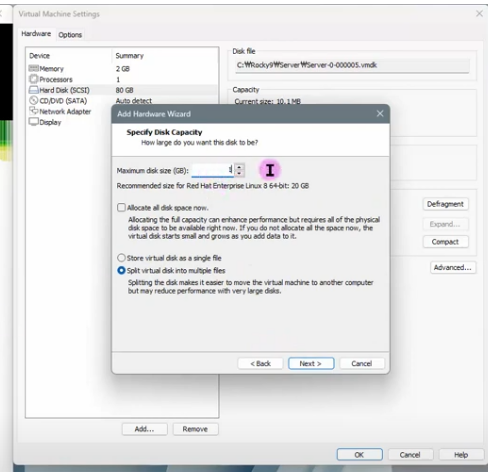

### 3. fdisk, mkfs, mount 명령어

`fdisk`, `mkfs`, 그리고 `mount`는 리눅스와 유닉스 기반 시스템에서 파일 시스템 관리를 위해 사용되는 명령어입니다. 

1. **fdisk:**
    - **용도:** 디스크 파티션을 관리하는 데 사용됩니다.
    - **사용 예시:**
        - `fdisk /dev/sdX`: 디스크 파티션을 관리하기 위해 해당 디스크를 엽니다.
        - `n`: 새로운 파티션 생성
        - `t`: 파티션의 유형 변경
        - `w`: 변경 사항을 디스크에 기록하고 종료

2. **mkfs:**
    - **용도:** 파일 시스템을 생성하는 데 사용됩니다.
    - **사용 예시:**
        - `mkfs -t ext4 /dev/sdXY`: ext4 파일 시스템을 생성합니다. (`/dev/sdXY`는 대상 파티션을 나타냄)

3. **mount:**
    - **용도:** 파일 시스템을 특정 디렉터리에 연결(마운트)하는 데 사용됩니다.
    - **사용 예시:**
        - `mount /dev/sdXY /mnt`: `/dev/sdXY`에 있는 파일 시스템을 `/mnt` 디렉터리에 마운트합니다.
        - `umount /mnt`: 마운트를 해제할 때 사용합니다.

예를 들어, 새로운 디스크를 사용하려면 `fdisk`를 사용하여 파티션을 생성하고, `mkfs`를 사용하여 파일 시스템을 생성한 다음, `mount` 명령어를 사용하여 해당 파일 시스템을 특정 디렉터리에 연결할 수 있습니다.

### 4. RAID란 무엇인가?

RAID(Redundant Array of Independent Disks)는 여러 개의 디스크 드라이브를 하나의 논리적 단위로 결합하여 데이터를 저장하고 보호하는 기술입니다. RAID는 여러 가지 수준으로 구성될 수 있으며, 각 수준은 다양한 방식으로 데이터를 분할, 복제, 조합하므로 데이터 보호 및 성능 향상을 달성할 수 있습니다.

RAID의 주요 수준 중 하나는 RAID 0입니다. RAID 0은 여러 개의 디스크를 하나의 큰 논리적 드라이브로 결합하는데, 데이터를 디스크 사이에 분할하여 저장합니다. 이는 성능을 향상시키지만, 데이터의 내결함성은 제공하지 않습니다. 실제로 RAID 0은 데이터 분산을 위한 용도로 사용되며, 디스크의 손실에 대한 복구 능력이 없기 때문에 주의가 필요합니다.

다른 RAID 수준에는 데이터 무결성 및 내결함성을 제공하는 RAID 1, RAID 5, RAID 6, RAID 10 등이 있습니다. 이러한 수준은 하드웨어 및 소프트웨어 구현에 따라 다양한 형태로 제공될 수 있습니다. RAID를 사용하여 데이터를 관리할 때는 주의해야 합니다. RAID 수준을 선택할 때는 데이터의 중요성, 성능 요구사항, 비용 등을 고려해야 합니다.

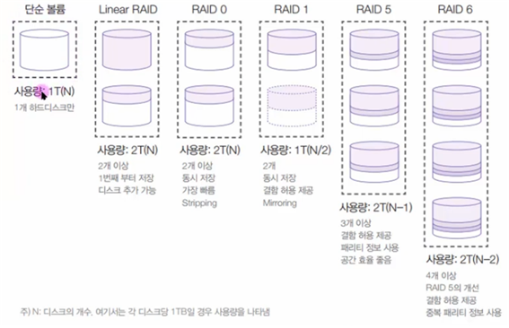

### 5. Stripping과 mirroring, 결함 허용이란?

**Stripping (또는 Striping):**
RAID 0에서 사용되는 개념으로, 데이터를 여러 디스크에 나누어 저장하는 방식입니다. 각 디스크에는 데이터의 일부가 저장되므로 병렬로 읽고 쓸 수 있어서 성능을 향상시킬 수 있습니다. 하지만, 이 방식은 하나의 디스크에 장애가 발생하면 전체 데이터가 손실되는 단점이 있습니다. 데이터의 안전성을 강조하는 것이 아니라 성능을 중시하는 경우에 사용됩니다.

**Mirroring:**
RAID 1에서 사용되는 개념으로, 데이터를 동일한 내용으로 여러 디스크에 복제하는 방식입니다. 각 디스크는 동일한 데이터를 가지고 있기 때문에 어느 한 디스크가 고장 나더라도 나머지 디스크에서 데이터를 복구할 수 있습니다. 이는 데이터의 안전성을 강화하는데 도움이 되지만, 저장 용량의 효율성은 떨어집니다. 두 개의 디스크 중 하나만 사용 가능하므로 저장 용량은 디스크의 개수의 반으로 제한됩니다.

**결함 허용 (Fault Tolerance):**
RAID에서 사용되는 개념으로, 하나 이상의 디스크에 문제가 발생해도 시스템이 계속 동작하고 데이터의 안정성을 유지할 수 있는 능력을 말합니다. Mirroring과 Parity를 사용한 RAID 수준들은 결함 허용을 제공하는데, 하드웨어 또는 소프트웨어적으로 디스크의 장애를 감지하고 복구할 수 있도록 구성됩니다. 이를 통해 시스템의 신뢰성이 향상되며 데이터 손실의 위험을 줄일 수 있습니다.

### 6. 패리티 정보와 중복 패리티 정보

**패리티 정보 (Parity Information):**

패리티는 데이터의 무결성을 확인하기 위한 정보로, 주로 RAID에서 사용됩니다. RAID에서는 여러 디스크에 데이터를 나누어 저장하는데, 이 중 하나의 디스크에 해당하는 패리티 정보는 나머지 디스크에 저장된 데이터를 기반으로 계산됩니다.

예를 들어, RAID 5에서는 여러 디스크에 데이터 블록을 나누어 저장하고, 한 디스크에 해당하는 패리티 정보는 나머지 디스크의 데이터 블록을 XOR 연산 등을 통해 계산됩니다. 이렇게 계산된 패리티 정보는 해당 디스크에 저장되어, 만약 디스크 중 하나에 장애가 발생하면 패리티 정보를 사용하여 손상된 데이터를 복구할 수 있습니다.

**중복 패리티 정보 (Double Parity Information):**

중복 패리티는 기본 패리티에 추가적인 안전성을 제공하는 개념입니다. 일반적인 RAID에서는 단일 디스크의 장애에 대비하여 패리티 정보를 사용하지만, 중복 패리티는 여러 디스크의 장애에 대비하기 위해 도입되었습니다.

예를 들어, RAID 6에서는 여러 디스크에 데이터를 나누어 저장하고, 두 개의 중복 패리티 정보가 계산되어 저장됩니다. 이렇게 하면 두 디스크에 장애가 발생하더라도 데이터를 복구할 수 있습니다. 중복 패리티는 RAID 6에서 주로 사용되며, 안정성이 중요한 환경에서 데이터 손실을 방지하는 데 도움을 줍니다.

### 7. Linear RAID

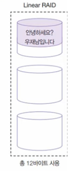

Linear RAID는 가장 간단한 형태의 소프트웨어 기반 RAID 레벨 중 하나입니다. 이는 데이터를 단순히 순차적으로 디스크에 저장하는 형태로서, 별도의 패리티 정보나 미러링을 사용하지 않습니다. 따라서 Linear RAID는 성능 향상이나 결함 허용을 위한 기능을 제공하지 않습니다.

Linear RAID의 특징은 다음과 같습니다:

1. **단순성:** Linear RAID는 가장 간단한 형태로, 데이터를 디스크에 순차적으로 저장합니다. 따라서 별도의 계산이나 패리티 정보를 유지하지 않으므로 단순합니다.

2. **성능 향상 없음:** Linear RAID는 여러 디스크에 데이터를 분산하지 않으며, 동시에 여러 디스크에서 읽기/쓰기를 수행하지 않습니다. 따라서 성능 향상 기능이 제한적입니다.

3. **결함 허용 없음:** Linear RAID는 디스크에 문제가 발생하면 해당 디스크의 데이터만 손실되는데, 별도의 결함 허용 기능이 없습니다. 디스크 장애에 강건한 기능을 제공하지 않습니다.

Linear RAID는 주로 단순한 데이터 저장이 필요한 환경에서 사용되며, 주로 안정성이나 성능 향상이 필요하지 않은 경우에 선택될 수 있습니다. 그러나 안전성과 성능이 중요한 환경에서는 다른 RAID 레벨이 더 적합할 수 있습니다.

### 8. RAID 0

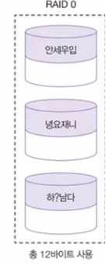

RAID 0은 여러 개의 디스크 드라이브를 하나의 논리적인 드라이브로 결합하는 RAID 레벨 중 하나입니다. RAID 0은 데이터를 여러 디스크에 나누어 저장하여 성능을 향상시키는데 중점을 둡니다. 그러나 데이터의 안전성이나 내결함성을 제공하지 않습니다.

RAID 0의 주요 특징은 다음과 같습니다:

1. **성능 향상:** RAID 0는 여러 디스크에 데이터를 분산하여 병렬로 읽고 쓸 수 있기 때문에 입출력 성능이 향상됩니다. 데이터의 일부가 각 디스크에 저장되므로 동시에 여러 디스크에서 데이터를 읽거나 쓸 수 있습니다.

2. **데이터의 분산:** RAID 0는 디스크에 데이터를 나누어 저장합니다. 예를 들어, 두 개의 디스크로 구성된 RAID 0에서는 데이터의 반을 한 디스크에, 나머지 반을 다른 디스크에 저장합니다.

3. **안전성 부족:** RAID 0는 어떤 한 디스크에 장애가 발생하면 해당 디스크에 저장된 데이터가 손실됩니다. 다른 RAID 레벨들과 달리 복구나 패리티 정보를 사용하지 않기 때문에 내결함성이 없습니다.

4. **저장 용량 활용:** RAID 0에서는 디스크 용량의 합계가 사용 가능한 저장 용량으로 인식됩니다. 따라서 디스크를 더 효과적으로 활용할 수 있습니다.

RAID 0는 주로 성능이 중요하고 데이터의 내결함성이 크게 강조되지 않는 환경에서 사용됩니다. 예를 들면, 비디오 편집 또는 임시 데이터 저장 공간 등이 해당됩니다. 그러나 주의할 점은 RAID 0에서는 하나의 디스크에 문제가 발생하면 전체 데이터가 영향을 받기 때문에 중요한 데이터의 경우에는 사용을 피하는 것이 좋습니다.

### 9. RAID 1

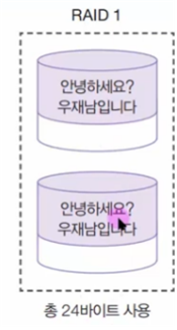

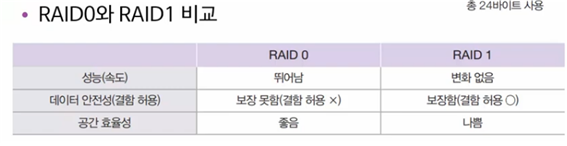

RAID 1은 여러 개의 디스크 드라이브를 사용하여 데이터를 미러링(복제)하여 저장하는 RAID 레벨 중 하나입니다. RAID 1은 데이터의 안전성과 내결함성을 강화하기 위해 설계되었습니다.

RAID 1의 주요 특징은 다음과 같습니다:

1. **데이터 미러링:** RAID 1은 각 디스크에 동일한 데이터의 복제본을 저장합니다. 즉, 하나의 디스크에 데이터를 기록하면 나머지 디스크에도 동일한 데이터가 복제됩니다.

2. **데이터의 안전성:** RAID 1은 여러 디스크에 데이터를 복사하므로 하나의 디스크에 장애가 발생하더라도 나머지 디스크에서 데이터를 제공할 수 있습니다. 이는 안전성을 향상시키며, 디스크 장애에 대응할 수 있습니다.

3. **쓰기 성능 향상은 제한적:** RAID 1에서는 읽기 성능은 향상되지만, 쓰기 성능은 일반적으로 제한적입니다. 데이터를 쓸 때마다 모든 미러링된 디스크에 데이터를 복사해야 하기 때문입니다.

4. **저장 용량 활용:** RAID 1에서는 디스크 용량의 반만 사용 가능한 저장 용량으로 간주됩니다. 예를 들어, 두 개의 디스크로 구성된 RAID 1에서는 하나의 디스크 용량만 사용 가능합니다.

RAID 1은 데이터의 중요성이 크고 안전성이 강조되는 환경에서 사용됩니다. 예를 들어, 중요한 서버의 운영 시스템, 데이터베이스, 또는 기업의 중요한 파일 서버 등에서 RAID 1이 사용될 수 있습니다. RAID 1은 단순하면서도 안정성이 높은 RAID 레벨 중 하나로 평가됩니다.

### 10. RAID 5

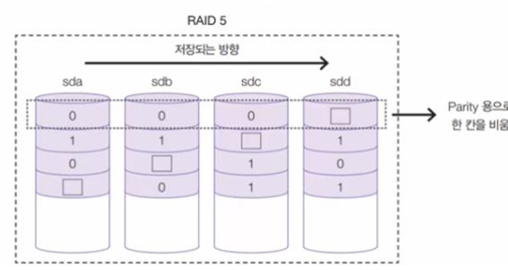

RAID 5는 여러 개의 디스크 드라이브를 사용하여 데이터를 분산 저장하고 패리티 정보를 사용하여 데이터의 내결함성을 제공하는 RAID 레벨 중 하나입니다. RAID 5은 RAID 0과 RAID 1의 장점을 조합하여 성능 향상과 안전성을 동시에 제공하는 구조를 갖추고 있습니다.

RAID 5의 주요 특징은 다음과 같습니다:

1. **데이터 분산 및 패리티 정보:** RAID 5에서는 데이터를 여러 디스크에 나누어 저장하고, 추가적으로 각 블록의 패리티 정보를 계산하여 저장합니다. 이 패리티 정보는 데이터 복구를 위해 사용됩니다.

2. **성능 향상:** RAID 5는 여러 디스크에서 동시에 데이터를 읽고 쓸 수 있기 때문에 성능이 향상됩니다. 특히 읽기 성능은 RAID 5에서 잘 동작합니다.

3. **내결함성:** RAID 5에서는 한 개의 디스크에 장애가 발생하더라도 나머지 디스크와 패리티 정보를 활용하여 손상된 데이터를 복구할 수 있습니다. RAID 5는 디스크 장애에 대해 비교적 강건한 성능을 제공합니다.

4. **저장 용량 활용:** RAID 5에서는 디스크 용량의 일부가 패리티 정보로 사용되므로, 전체 디스크 중 하나의 용량이 패리티에 할당되고 나머지는 데이터에 할당됩니다. 이로써 저장 용량이 효율적으로 활용됩니다.

RAID 5는 중간 수준의 성능과 안전성이 필요한 환경에서 흔히 사용됩니다. 그러나 최근에는 RAID 6이나 RAID 10과 같은 안전성이 높은 대안이 더 많이 사용되고 있습니다. RAID 5에서 주의할 점은 디스크 장애 시 복구 중에 추가적인 디스크 장애가 발생하면 데이터 손실이 발생할 수 있다는 것입니다. RAID 6는 이러한 문제를 보완하기 위해 도입되었습니다.

### 11. RAID 6

RAID 6는 여러 개의 디스크 드라이브를 사용하여 데이터를 분산 저장하고 여분의 패리티 정보를 제공하여 데이터의 안전성을 향상시킨 RAID 레벨 중 하나입니다. RAID 6은 RAID 5의 단점 중 하나인 "두 번째 디스크 장애 시 데이터 손실" 문제를 해결하기 위해 개발되었습니다.

RAID 6의 주요 특징은 다음과 같습니다:

1. **데이터 분산 및 이중 패리티 정보:** RAID 6는 RAID 5와 비슷하게 데이터를 여러 디스크에 나누어 저장하고, 추가적으로 이중 패리티 정보를 계산하여 저장합니다. 이렇게 하면 두 개의 디스크에 동시에 장애가 발생하더라도 데이터 손실이 없도록 보장합니다.

2. **내결함성:** RAID 6에서는 두 개의 디스크에 장애가 발생하더라도 나머지 디스크와 패리티 정보를 활용하여 손상된 데이터를 복구할 수 있습니다. 따라서 RAID 6는 RAID 5보다 더 높은 내결함성을 제공합니다.

3. **성능 향상:** RAID 6는 여러 디스크에서 동시에 데이터를 읽고 쓸 수 있어 성능이 향상됩니다. 특히 읽기 성능은 RAID 6에서 잘 동작합니다.

4. **저장 용량 활용:** RAID 6에서는 디스크 용량의 일부가 이중 패리티 정보로 사용되므로, 전체 디스크 중 두 개의 용량이 패리티에 할당되고 나머지는 데이터에 할당됩니다.

RAID 6은 중요한 데이터의 안전성이 필요한 환경에서 많이 사용됩니다. 특히 대용량 디스크를 사용하는 환경에서는 RAID 6가 두 번의 디스크 장애에도 안전하게 데이터를 보호할 수 있는 장점이 있습니다.

### 12. RAID 1+ 0

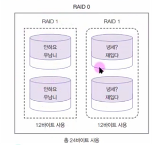

RAID 1+0, 또는 RAID 10은 RAID 1과 RAID 0을 결합한 형태의 RAID 레벨입니다. RAID 10은 데이터의 안전성과 성능을 동시에 제공하는데 중점을 둔 구조를 갖추고 있습니다.

RAID 10의 주요 특징은 다음과 같습니다:

1. **데이터 미러링 및 분산:** RAID 10은 여러 개의 디스크 드라이브를 사용하며, 각각의 디스크는 미러링 형태로 구성됩니다. 즉, 각 데이터는 최소한 두 개의 디스크에 복제됩니다. 그 후, 이러한 미러링된 데이터가 다시 RAID 0의 스트라이핑 기술을 사용하여 분산 저장됩니다.

2. **데이터의 안전성:** RAID 10에서는 두 개의 디스크에 중 하나라도 문제가 발생하면 나머지 미러링된 디스크에서 데이터를 복구할 수 있습니다. 이는 RAID 1의 안정성을 제공합니다.

3. **성능 향상:** RAID 10은 RAID 0의 성능 향상 특성도 가지고 있습니다. 여러 디스크에서 동시에 읽고 쓰기를 수행할 수 있기 때문에 성능이 향상됩니다.

4. **저장 용량 활용:** RAID 10에서는 디스크 용량의 절반만 사용 가능한 저장 용량으로 간주됩니다. 예를 들어, 4개의 디스크로 구성된 RAID 10에서는 2개의 디스크만을 사용하여 데이터를 저장합니다.

RAID 10은 안정성과 성능을 모두 고려해야 하는 환경에서 사용됩니다. 중요한 데이터를 안전하게 보호하면서도 성능을 유지하고자 할 때 효과적인 선택입니다. RAID 10은 하드웨어 RAID 컨트롤러 또는 소프트웨어 RAID로 구성될 수 있습니다.

### 13. RAID 구현하기

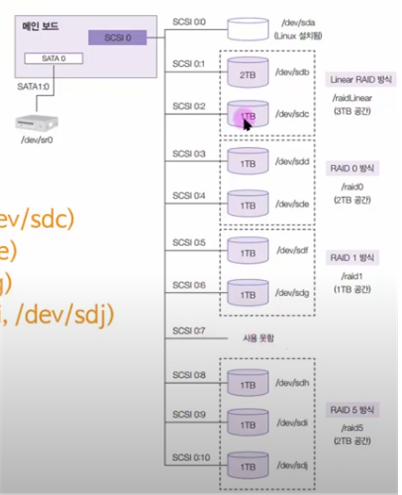

### 14. Linear RAID 흐름도

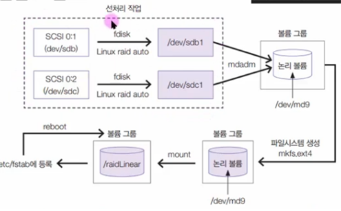

### 15. RAID에 문제가 발생하게 된다면?

RAID에서 문제가 발생하면 처리 방법은 RAID 레벨과 구현 방식에 따라 달라집니다. 일반적으로 RAID는 하나 이상의 디스크에 장애가 발생해도 데이터 손실을 방지하거나 최소화하기 위해 설계되었습니다. 하지만 여전히 문제가 발생할 수 있고, 그 경우에는 다음과 같은 절차를 따를 수 있습니다.

1. **디스크 교체:**
    - RAID 1, RAID 5, RAID 6와 같이 결함 허용 기능을 갖춘 RAID에서는 손상된 디스크를 교체해야 합니다. 교체된 디스크는 RAID에 다시 추가되어 복구 프로세스가 시작됩니다.

2. **재구성 및 복구:**
    - RAID 1: 교체된 디스크가 새로운 디스크로 재구성되고 데이터가 복구됩니다.
    - RAID 5 및 RAID 6: 장애가 발생한 디스크를 대체하고, RAID는 패리티 정보를 사용하여 손상된 데이터를 복구합니다.

3. **RAID 관리 도구 사용:**
    - 하드웨어 RAID 컨트롤러를 사용하는 경우, 해당 컨트롤러의 관리 도구를 통해 RAID 상태를 모니터링하고 문제를 해결할 수 있습니다.

4. **백업과 복원:**
    - RAID에서도 중요한 데이터에 대한 정기적인 백업은 중요합니다. 데이터가 손실될 경우, 최신 백업으로 시스템을 복원할 수 있습니다.

5. **전원 문제나 하드웨어 결함 처리:**
    - RAID에서는 전원 문제나 하드웨어 결함이 문제의 원인이 될 수 있습니다. 해당 문제를 해결하고 RAID 장치나 컨트롤러의 상태를 확인하여 안전한 운영을 지속할 수 있도록 합니다.

6. **기타 RAID 관리 도구 사용:**
    - 소프트웨어 RAID를 사용하는 경우, 해당 운영체제의 RAID 관리 도구를 사용하여 RAID 구성 및 상태를 확인하고 문제를 해결할 수 있습니다.

RAID에서 문제가 발생하면 빠른 대응이 중요하며, 구체적인 조치는 사용 중인 RAID 레벨과 하드웨어 또는 소프트웨어 환경에 따라 다를 수 있습니다.

### 16. RAID 원상복구


### 17. RAID 6와 1+0

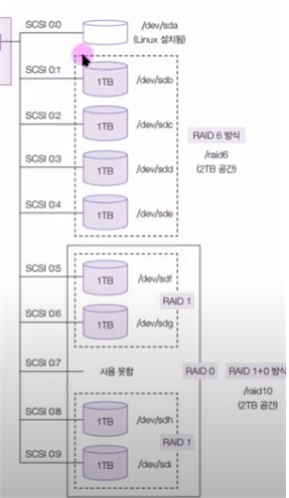

### 18. RAID 6와 RAID 1+0의 문제 발생

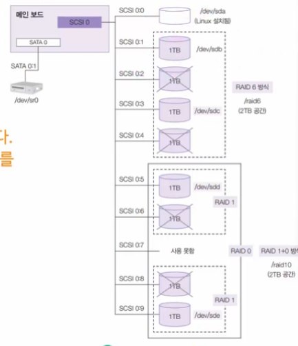

### 19. LVM 개념 이해

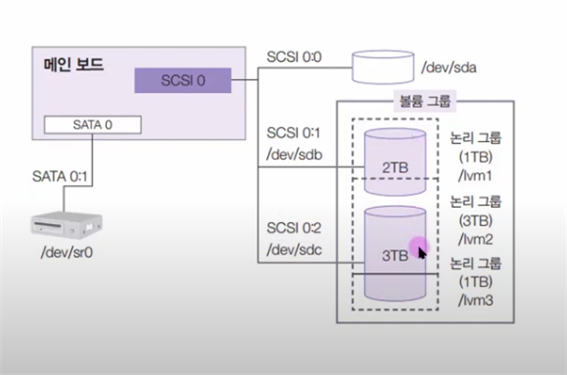

1. **물리 볼륨 (Physical Volume, PV):**
    - 물리 디스크나 디스크 파티션 등을 가리키며, 이들은 물리적인 저장장치를 나타냅니다.
    - LVM은 물리 볼륨을 사용하여 물리적인 디스크를 논리적인 LVM 공간으로 변환합니다.

2. **볼륨 그룹 (Volume Group, VG):**
    - 하나 이상의 물리 볼륨을 묶어서 만든 논리적인 단위입니다.
    - 여러 물리 볼륨을 하나의 볼륨 그룹으로 묶으면 그 안에서 논리 볼륨을 유연하게 생성 및 관리할 수 있습니다.

3. **논리 볼륨 (Logical Volume, LV):**
    - 볼륨 그룹 안에서 생성된 논리적인 디스크 볼륨입니다.
    - 논리 볼륨은 파일 시스템을 포함한 다양한 용도로 사용될 수 있습니다.

LVM을 사용하면 다음과 같은 장점이 있습니다:

- **유연한 용량 관리:** 물리 볼륨의 크기를 동적으로 조절하거나 여러 물리 볼륨을 하나로 묶어 논리 볼륨을 생성하는 등의 유연한 용량 관리가 가능합니다.

- **데이터 이동 및 확장:** 데이터를 물리 디스크 간에 이동하거나 볼륨 그룹을 확장하는 등의 작업이 쉽게 수행될 수 있습니다.

- **스냅샷 및 복제:** LVM은 스냅샷을 지원하여 특정 시점의 논리 볼륨 상태를 보존하고 복제할 수 있습니다.

간단하게 말하면, LVM은 물리적인 디스크를 추상화하여 논리적인 레벨에서 디스크 공간을 관리하고 제어하는 도구를 제공하여 운영 체제와 사용자에게 편리성과 효율성을 제공합니다.

### 20. pvcreate, vgcreate, lvcreate의 개념


1. **물리볼륨 (Physical Volume - PV):**
    - 물리적인 스토리지 디바이스를 나타냅니다. 일반적으로 디스크 파티션 또는 전체 디스크를 물리볼륨으로 설정합니다. `pvcreate` 명령어를 사용하여 물리볼륨을 생성합니다.

   ```bash
   pvcreate /dev/sdX
   ```

2. **볼륨그룹 (Volume Group - VG):**
    - 하나 이상의 물리볼륨을 묶어서 논리볼륨을 생성하기 위한 그룹을 의미합니다. 논리적인 스토리지 풀을 만들어 여러 물리볼륨을 추가할 수 있습니다. `vgcreate` 명령어를 사용하여 볼륨그룹을 생성합니다.

   ```bash
   vgcreate myvg /dev/sdX1 /dev/sdX2
   ```

3. **논리볼륨 (Logical Volume - LV):**
    - 볼륨그룹 내에서 생성되는 논리적인 볼륨을 나타냅니다. 논리볼륨은 물리적인 스토리지의 일부분이며, 파일 시스템을 생성하여 마운트할 수 있습니다. `lvcreate` 명령어를 사용하여 논리볼륨을 생성합니다.

   ```bash
   lvcreate -L 10G -n mylv myvg
   ```

   이 명령어는 `myvg`라는 볼륨그룹에 10GB 크기의 `mylv`라는 논리볼륨을 생성합니다.

### 21. RAID에 리눅스 설치하기

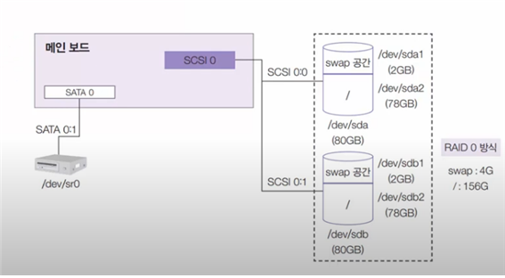

### 22. 사용자별 공간 할당 – 쿼터

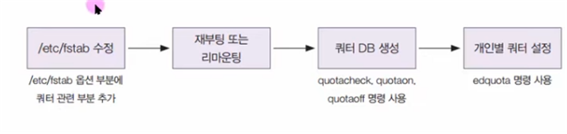

"쿼터(Quota)"는 리눅스 시스템에서 사용자 또는 그룹이 소유한 파일 시스템 공간에 대한 사용량을 제한하거나 모니터링하는 데 사용되는 기능입니다. 이는 디스크 공간 사용을 통제하고 오버 사용을 방지하기 위해 도입된 것입니다.

쿼터의 주요 특징은 다음과 같습니다:

1. **사용자 또는 그룹 단위의 제한:** 쿼터는 각 사용자 또는 그룹이 소유한 파일 시스템 공간에 대한 사용량을 제한하는 데 사용됩니다. 이를 통해 각 사용자가 할당된 스토리지 용량을 초과하지 못하도록 할 수 있습니다.

2. **모니터링:** 쿼터를 활성화하면 각 사용자 또는 그룹의 스토리지 사용량을 모니터링할 수 있습니다. 이를 통해 시스템 관리자는 스토리지 사용량이 어떻게 분산되고 있는지 파악할 수 있습니다.

3. **경고 및 제한:** 사용량이 정해진 한계를 초과하면 쿼터 시스템은 경고를 발생시키거나 쓰기 작업을 제한할 수 있습니다. 이는 디스크 공간의 오버 사용을 방지하고 시스템의 안정성을 유지하는 데 도움이 됩니다.

4. **적용 범위:** 쿼터는 주로 사용자 홈 디렉터리, 프로젝트 디렉터리, 공유 디렉터리 등 특정 디렉터리 또는 파일 시스템에 적용됩니다.

쿼터를 설정하려면 리눅스 시스템에서 `quota` 패키지가 설치되어 있어야 하며, `/etc/fstab` 파일에서 해당 파일 시스템에 대한 쿼터 옵션을 활성화해야 합니다. 그리고 `edquota` 명령어를 사용하여 각 사용자 또는 그룹의 쿼터를 설정할 수 있습니다.

### 23. 쿼터와 관련된 상세 옵션들과 명령어

리눅스에서 쿼터(Quota)를 설정하고 관리하기 위해서는 `quota` 패키지가 설치되어 있어야 합니다. 쿼터 설정에 관련된 주요 파일은 `/etc/fstab`와 `/etc/mtab`이며, 관리를 위한 명령어는 `quota`와 `edquota` 등이 있습니다. 아래는 쿼터와 관련된 주요 옵션과 명령어에 대한 간략한 설명입니다:

### 1) `/etc/fstab` 파일 설정:

쿼터를 사용하려면 해당 파일 시스템이 쿼터를 지원하도록 `/etc/fstab` 파일을 설정해야 합니다. 예를 들어, `/home` 디렉터리를 포함하는 파일 시스템에 쿼터를 사용하려면 다음과 같이 설정할 수 있습니다:

```bash
/dev/sdaX   /home   ext4   defaults,usrquota,grpquota   0  2
```

- `usrquota`: 사용자 쿼터를 활성화합니다.
- `grpquota`: 그룹 쿼터를 활성화합니다.

### 2) `/etc/mtab` 파일 업데이트:

마운트된 파일 시스템에 대한 쿼터를 적용하려면 `/etc/mtab` 파일을 업데이트해야 합니다. 이를 위해 `mount -o remount` 명령어를 사용합니다:

```bash
mount -o remount /home
```

### 3) 사용자 또는 그룹 쿼터 설정:

`edquota` 명령어를 사용하여 특정 사용자 또는 그룹에 대한 쿼터를 설정합니다. 예를 들어, 사용자 `john`의 쿼터를 설정하려면 다음과 같이 실행합니다:

```bash
edquota -u john
```

또는 그룹 `developers`에 대한 쿼터를 설정하려면:

```bash
edquota -g developers
```

### 4) 사용량 확인:

`quota` 명령어를 사용하여 사용자 또는 그룹의 현재 사용량을 확인할 수 있습니다:

```bash
quota john
```

또는 그룹에 대한 사용량 확인:

```bash
quota -g developers
```

### 5) 사용량 경고 및 제한 설정:

`edquota` 명령어를 사용하여 사용자 또는 그룹에 대한 사용량 경고와 제한을 설정할 수 있습니다.

### 6) 쿼터 서비스 시작 및 중지:

 `quotacheck`, `quotaon`, `quotaoff` 명령어가 사용됩니다.

