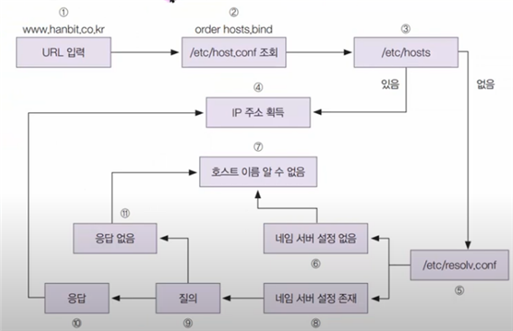
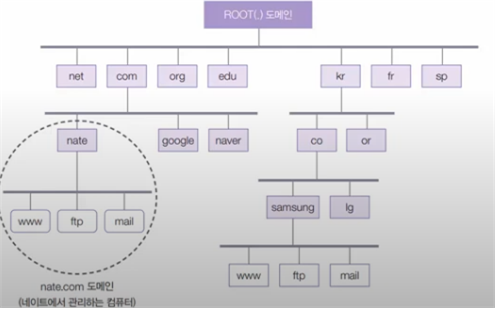
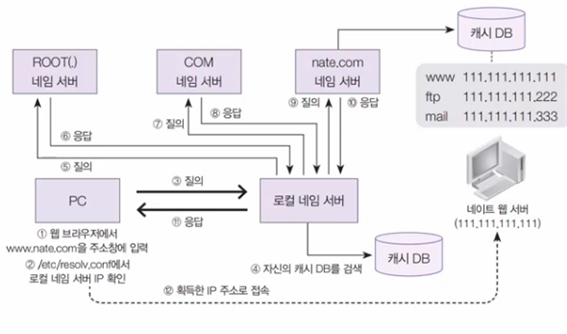
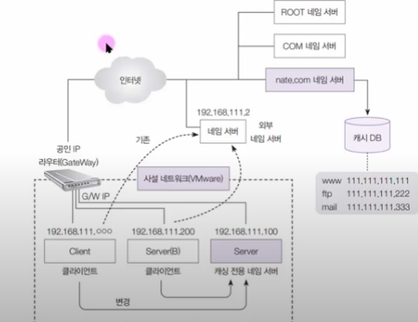
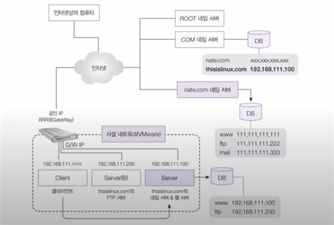
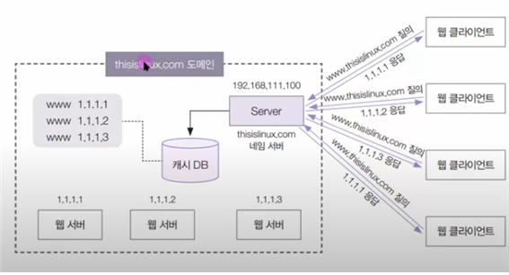

### 1. 네임서버란 무엇인가?

네임서버는 인터넷에서 도메인 이름과 IP 주소를 연결하는 역할을 하는 서버입니다. 간단히 말하면, 사용자가 읽기 쉬운 도메인 이름을 입력하면 네임서버는 해당 도메인 이름에 대응하는 IP 주소를 찾아서 사용자의 웹 브라우저나 다른 네트워크 애플리케이션에게 전달합니다.

네임서버의 주요 역할은 다음과 같습니다:

1. **도메인 이름 해석 (Domain Name Resolution):** 네임서버는 사용자가 입력한 도메인 이름을 해당 도메인에 대응하는 IP 주소로 해석합니다. 이는 사용자가 기억하기 쉬운 도메인 이름을 실제 네트워크에서 사용되는 숫자로 된 IP 주소로 변환하는 프로세스입니다.

2. **도메인 이름 시스템 (DNS) 관리:** 네임서버는 전 세계적으로 분산된 DNS 시스템의 일부로서, 도메인 이름과 IP 주소의 매핑 정보를 관리하고 이를 다른 네임서버들과 공유합니다.

3. **도메인 등록 정보 제공:** 도메인 이름이 등록될 때, 해당 도메인의 네임서버 정보도 함께 등록됩니다. 이 정보는 도메인 등록 업체에서 관리되며, 네임서버는 해당 도메인이 어떤 서버에 연결되어 있는지를 나타냅니다.

네임서버는 계층적인 구조를 가지고 있으며, 최상위 도메인(TLD) 서버부터 시작하여 하위 도메인의 네임서버까지 차례로 쿼리를 수행하여 도메인 이름을 해석합니다. 이러한 분산된 구조로 인해 도메인 이름의 해석이 효율적으로 이루어집니다.

### 2. /etc/host 파일

`/etc/hosts` 파일은 운영체제에서 사용하는 로컬 도메인 이름과 IP 주소의 매핑 정보를 저장하는 파일입니다. 이 파일을 편집하여 특정 도메인 이름을 원하는 IP 주소로 연결할 수 있습니다.

예를 들어, `/etc/hosts` 파일을 이용하여 `example.com` 도메인을 IP 주소 `203.0.113.1`로 매핑하고자 한다면, 다음과 같이 파일을 편집합니다.

```plaintext
203.0.113.1   example.com
```

이제 시스템은 `example.com`에 대한 DNS 조회를 로컬 `/etc/hosts` 파일에서 해결하게 됩니다.

**nslookup 명령어를 사용하여 네임서버 정보 확인:**

1. 터미널 또는 명령 프롬프트에서 `nslookup` 명령어를 입력합니다.
2. `>` 프롬프트가 나타나면 원하는 도메인 이름을 입력합니다.

예를 들어, `example.com`의 네임서버 정보를 확인하려면:

```plaintext
nslookup example.com
```

위 명령을 실행하면 해당 도메인의 네임서버 정보가 출력됩니다. 이 정보를 통해 도메인 이름이 어떤 IP 주소에 매핑되어 있는지와 해당 도메인의 네임서버 주소 등을 확인할 수 있습니다.

### 3. ip 주소를 얻는 내부 흐름



### 4. 도메인 이름 체계



### 5. 로컬 네임서버가 작동하는 순서

로컬 네임 서버는 특정 네트워크 또는 시스템 내에서 사용되는 네임 서버로, 해당 네트워크 또는 시스템에서 도메인 이름을 IP 주소로 해석하는 역할을 합니다. 이는 일반적으로 큰 규모의 네트워크나 기업 환경에서 사용되며, 로컬 네임 서버는 네트워크 내에서 DNS(Domain Name System) 조회를 처리하는 역할을 합니다.

로컬 네임 서버의 주요 특징은 다음과 같습니다:

1. **로컬 캐싱(Caching):** 로컬 네임 서버는 이전에 해결한 도메인 이름에 대한 정보를 일정 기간 동안 캐싱합니다. 이로써 동일한 도메인에 대한 반복적인 조회가 있을 경우에도 외부 DNS 서버에 다시 조회를 보내지 않고 로컬에서 빠르게 응답할 수 있습니다.

2. **보안 및 제어:** 로컬 네임 서버를 사용하면 네트워크 관리자가 네트워크 내의 DNS 조회를 제어하고 모니터링할 수 있습니다. 또한 보안 정책을 적용하여 악성 도메인 또는 콘텐츠에 대한 차단도 가능합니다.

3. **성능 향상:** 로컬 네임 서버는 네트워크 내의 사용자들에게 빠르고 일관된 DNS 조회 서비스를 제공하여 웹 페이지 로딩 등의 성능을 향상시킬 수 있습니다.

로컬 네임 서버는 일반적으로 DHCP (Dynamic Host Configuration Protocol)를 통해 자동으로 사용자의 컴퓨터에 할당되거나, 수동으로 구성할 수 있습니다. 네트워크 내에서 효율적이고 안정적인 DNS 조회를 지원하기 위해 로컬 네임 서버가 사용됩니다.



### 6. 캐싱 전용 네임 서버

캐싱 전용 네임 서버는 주로 DNS 조회 결과를 캐싱하여 더 빠른 응답을 제공하는 서버입니다. 이러한 서버는 특정 도메인 이름의 IP 주소를 해석하는 것이 아니라, 다른 DNS 서버로부터 얻은 정보를 일시적으로 저장하고, 동일한 조회가 반복될 때 이 캐시된 정보를 사용하여 응답합니다.

캐싱 전용 네임 서버의 특징은 다음과 같습니다:

1. **성능 향상:** 이 서버는 이전에 해결한 도메인 이름에 대한 정보를 캐싱하여, 동일한 도메인에 대한 반복적인 조회를 외부 DNS 서버에 보내지 않고 로컬에서 빠르게 응답할 수 있습니다. 이를 통해 전체적인 DNS 조회의 성능이 향상됩니다.

2. **트래픽 감소:** 로컬 캐싱으로 인해 외부 DNS 서버로의 쿼리 트래픽이 감소하므로, 네트워크 대역폭을 효과적으로 관리할 수 있습니다.

3. **신뢰성 향상:** 외부 DNS 서버에 의존하지 않고 로컬에서 DNS 정보를 관리하기 때문에, 외부 DNS 서버에 장애가 발생해도 로컬 네임 서버는 캐시된 정보를 사용하여 계속해서 동작할 수 있습니다.

캐싱 전용 네임 서버는 주로 인터넷 서비스 제공자(ISP), 기업 내부 네트워크, 로컬 오픈DNS 서버 등에서 사용됩니다. 이러한 서버는 일반적으로 빠르고 안정적인 DNS 조회를 지원하여 사용자 경험을 향상시키는 데 기여합니다.



### 7. 마스터 네임 서버

마스터 네임 서버는 DNS (Domain Name System)에서 사용되는 용어 중 하나로, 특정 DNS 존(Zone)의 권한이 있는 최초의 소스입니다. DNS는 도메인 이름과 IP 주소 간의 매핑 정보를 관리하는 시스템으로, 도메인에 대한 정보를 관리하는 단위를 "존"이라고 합니다.

마스터 네임 서버의 주요 특징은 다음과 같습니다:

1. **존의 권한 소유:** 마스터 네임 서버는 특정 도메인에 대한 권한을 갖고 있어 해당 도메인에 대한 DNS 레코드를 생성, 수정, 삭제할 수 있습니다.

2. **존 파일 관리:** 마스터 네임 서버는 해당 존의 정보를 가진 존 파일을 관리합니다. 이 파일에는 도메인의 DNS 레코드, 즉 도메인 이름과 IP 주소 간의 매핑 정보와 다양한 유형의 레코드들이 포함되어 있습니다.

3. **DNS 업데이트:** 존에 대한 변경이 발생할 때, 즉시 DNS 정보를 업데이트하고 이를 다른 DNS 서버들에게 전파합니다.

마스터 네임 서버는 하나의 존에 대한 권한을 가지며, 해당 존의 소유자는 DNS 레코드의 변경 및 업데이트를 관리할 수 있습니다. 이러한 마스터 네임 서버는 주로 도메인을 등록한 기업 또는 DNS 책임자가 소유하고 있습니다.

존의 변경이 필요한 경우, 마스터 네임 서버에서 변경이 이루어지고, 변경된 정보는 해당 존에 대한 다른 네임 서버들로 전파되어 일관성을 유지합니다.



### 8. 라운드 로빈 네임 서버

라운드 로빈 네임 서버는 여러 대의 서버가 동일한 도메인 이름에 대해 교대로 응답하도록 구성된 네임 서버입니다. 클라이언트의 DNS 쿼리가 들어올 때마다, 라운드 로빈 알고리즘에 따라 서버 목록 중 하나가 선택되어 응답을 처리합니다.

라운드 로빈 네임 서버의 특징은 다음과 같습니다:

1. **균등한 부하 분산:** 라운드 로빈 알고리즘은 서버 목록을 순환하면서 요청을 분산시키기 때문에 각 서버에 대한 부하를 균등하게 분산할 수 있습니다.

2. **간단한 구현:** 라운드 로빈은 구현이 간단하고 효과적이며, 추가적인 하드웨어나 소프트웨어 구성이 필요하지 않습니다.

3. **장애 대응이 제한적:** 라운드 로빈은 각 서버에 대해 동일한 가중치를 부여하기 때문에 서버 간의 성능 차이가 크거나 특정 서버에 장애가 발생한 경우, 효과적으로 대응하기 어렵습니다.

4. **DNS TTL 고려:** DNS TTL(Time to Live)은 라운드 로빈의 효과를 제어하는 데 중요합니다. TTL이 낮으면 빠르게 변경이 이루어지지만, 높으면 변경이 느리게 반영됩니다.

라운드 로빈 네임 서버는 주로 부하 분산이나 가용성 향상을 목적으로 사용됩니다. 그러나 성능이나 신뢰성 면에서 고급 부하 분산 기술이 필요한 경우, 로드 밸런서와 같은 다른 기술이 고려될 수 있습니다.

